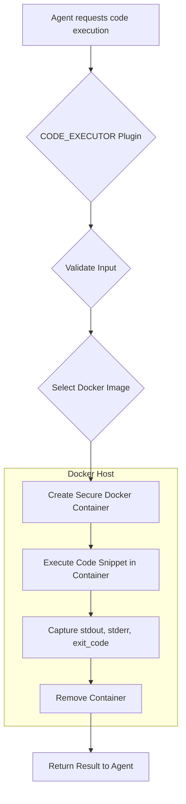

# CODE_EXECUTOR Plugin Design

## 1. Overview

This document outlines the design for the `CODE_EXECUTOR` plugin. The plugin's purpose is to provide a secure, sandboxed environment for executing code snippets in multiple languages, starting with Python and JavaScript.

The core of this design is a two-level execution model:
1.  **Plugin Execution:** The `CODE_EXECUTOR` plugin itself is executed by the `CapabilitiesManager` within its standard Node.js environment, as described in `shared/src/security/isolatedPluginSandbox.ts`.
2.  **Snippet Execution:** The arbitrary code snippets provided to the plugin are executed in a separate, highly secure sandbox using **Docker containers**. This ensures that untrusted code cannot access the host system's resources.

## 2. File Structure

The `CODE_EXECUTOR` plugin will be located in `services/capabilitiesmanager/src/plugins/CODE_EXECUTOR/` and will have the following structure:

```
services/capabilitiesmanager/src/plugins/CODE_EXECUTOR/
├── Dockerfile.python
├── Dockerfile.javascript
├── main.py
├── manifest.json
├── openapi.json
└── requirements.txt
```

*   **`Dockerfile.python`**: Defines the Docker image for the Python execution environment.
*   **`Dockerfile.javascript`**: Defines the Docker image for the JavaScript (Node.js) execution environment.
*   **`main.py`**: The main entry point for the plugin logic, responsible for managing Docker containers.
*   **`manifest.json`**: The plugin's manifest file.
*   **`openapi.json`**: The OpenAPI specification for the plugin's API.
*   **`requirements.txt`**: Python dependencies for the plugin (e.g., `docker` sdk).

## 3. manifest.json

```json
{
  "id": "plugin-CODE_EXECUTOR",
  "verb": "CODE_EXECUTOR",
  "description": "Executes code snippets in a sandboxed environment.",
  "explanation": "This plugin takes a code snippet and a language, and executes it in a secure, isolated Docker container. It returns the standard output, standard error, and exit code.",
  "inputDefinitions": [
    {
      "name": "language",
      "required": true,
      "type": "string",
      "description": "The programming language of the code snippet. Supported: 'python', 'javascript'."
    },
    {
      "name": "code",
      "required": true,
      "type": "string",
      "description": "The code snippet to execute."
    }
  ],
  "outputDefinitions": [
    {
      "name": "stdout",
      "required": true,
      "type": "string",
      "description": "The standard output from the code execution."
    },
    {
      "name": "stderr",
      "required": true,
      "type": "string",
      "description": "The standard error from the code execution."
    },
    {
      "name": "exit_code",
      "required": true,
      "type": "number",
      "description": "The exit code of the execution process."
    }
  ],
  "language": "python",
  "entryPoint": {
    "main": "main.py",
    "function": "execute_plugin"
  },
  "repository": {
    "type": "local"
  },
  "security": {
    "permissions": [
      "docker.run"
    ],
    "sandboxOptions": {
      "allowEval": false,
      "timeout": 60000,
      "memory": 268435456,
      "allowedModules": [
        "json",
        "sys",
        "os",
        "docker"
      ]
    }
  },
  "version": "1.0.0",
  "metadata": {
    "author": "Stage7 Development Team",
    "tags": ["code", "execution", "sandbox", "python", "javascript"],
    "category": "utility",
    "license": "MIT"
  }
}
```

## 4. openapi.json

```json
{
  "openapi": "3.0.0",
  "info": {
    "title": "CODE_EXECUTOR Plugin API",
    "version": "1.0.0",
    "description": "API for executing code snippets in a sandboxed environment."
  },
  "paths": {
    "/execute_code": {
      "post": {
        "summary": "Execute a code snippet",
        "operationId": "execute_code",
        "requestBody": {
          "required": true,
          "content": {
            "application/json": {
              "schema": {
                "type": "object",
                "properties": {
                  "language": {
                    "type": "string",
                    "description": "The programming language of the code snippet.",
                    "enum": ["python", "javascript"]
                  },
                  "code": {
                    "type": "string",
                    "description": "The code snippet to execute."
                  }
                },
                "required": ["language", "code"]
              }
            }
          }
        },
        "responses": {
          "200": {
            "description": "Code executed successfully.",
            "content": {
              "application/json": {
                "schema": {
                  "type": "object",
                  "properties": {
                    "stdout": {
                      "type": "string",
                      "description": "The standard output from the code execution."
                    },
                    "stderr": {
                      "type": "string",
                      "description": "The standard error from the code execution."
                    },
                    "exit_code": {
                      "type": "number",
                      "description": "The exit code of the execution process."
                    }
                  }
                }
              }
            }
          }
        }
      }
    }
  }
}
```

## 5. High-Level Logic and Sandboxing Strategy

The core logic in `main.py` will orchestrate the secure execution of code snippets using Docker.

### Sandboxing Workflow

The sandboxing process will follow these steps:

1.  **Input Validation:** The plugin will first validate the `language` and `code` inputs.
2.  **Docker Image Selection:** Based on the `language`, the plugin will select the appropriate Docker image to use (e.g., `code-executor-python:latest`). These images will be built from the `Dockerfile.python` and `Dockerfile.javascript` files.
3.  **Container Creation:** A new Docker container will be created from the selected image with strict security constraints:
    *   **No network access:** `network_mode='none'`
    *   **Read-only root filesystem:** `read_only=True`
    *   **Resource limits:** CPU, memory, and execution timeout will be applied.
    *   **No volume mounts:** To prevent access to the host filesystem.
4.  **Code Execution:** The code snippet is passed to the container's entry point and executed.
5.  **Result Capture:** The `stdout`, `stderr`, and `exit_code` are captured from the container.
6.  **Container Removal:** The container is stopped and removed immediately after execution to ensure a stateless and clean environment for each run.

### Mermaid Diagram of the Process



### `Dockerfile.python` (Example)

```dockerfile
FROM python:3.9-slim
WORKDIR /app
COPY . .
# Create a non-root user for execution
RUN useradd -m coder
USER coder
CMD ["python", "-c", "import sys; exec(sys.stdin.read())"]
```

### `Dockerfile.javascript` (Example)

```dockerfile
FROM node:18-alpine
WORKDIR /app
COPY . .
# Create a non-root user for execution
RUN addgroup -S coder && adduser -S coder -G coder
USER coder
CMD ["node", "-e", "const fs = require('fs'); const code = fs.readFileSync(0, 'utf-8'); eval(code);"]
```

This design ensures that the `CODE_EXECUTOR` plugin is both powerful and secure, providing a reliable way for agents to run code while protecting the integrity of the host system.