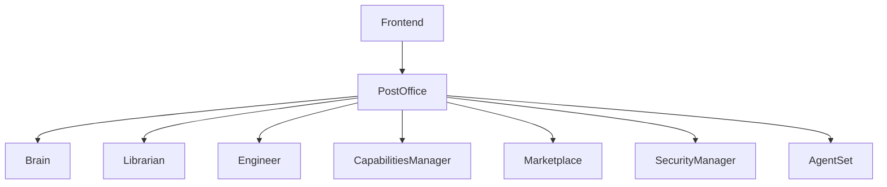

# Stage7 Developer Quick Reference Guide

## Overview

This guide provides developers with essential information about the Stage7 system architecture, key components, and development best practices. It serves as a starting point for understanding the system's structure and how to work with its core components.

## System Architecture

The Stage7 system follows a microservices architecture with the following key components:



### Core Services

1. **PostOffice**: Main entry point and message router
2. **Brain**: LLM-based planning and decision making
3. **Librarian**: Knowledge management and tool discovery
4. **Engineer**: Plugin development and tool engineering
5. **CapabilitiesManager**: Plugin execution and capability management
6. **Marketplace**: Plugin repository and management
7. **SecurityManager**: Authentication and authorization
8. **AgentSet**: Agent management and coordination

## Development Setup

### Prerequisites

- Node.js 20+
- Docker 20.10+
- Python 3.9+
- MongoDB and Redis

### Getting Started

```bash
# Clone the repository
git clone https://github.com/your-repo/stage7.git
cd stage7

# Install dependencies
npm install

# Set up environment variables
cp .env.example .env
# Edit .env with your configuration

# Build and start services
docker compose build
docker compose up -d
```

## Key Development Patterns

### Plugin Development

The Stage7 system supports multiple plugin types:

1. **Python Plugins**: Standard Python-based plugins
2. **JavaScript Plugins**: Node.js-based plugins
3. **Containerized Plugins**: Docker-based plugins for complex tools

### Tool Discovery

The system uses semantic search for tool discovery through the Librarian service:

```typescript
// Example: Discovering tools for a specific task
const tools = await librarianClient.discoverTools({
    query: "analyze financial data",
    context: "quarterly report generation"
});
```

### Plan Execution

Plans are executed through the AgentSet service using ActionVerbTasks:

```typescript
// Example: Creating and executing a plan
const plan: ActionVerbTask[] = [
    {
        actionVerb: "ANALYZE_DATA",
        inputs: {
            data: { value: "sample data", valueType: "string" }
        }
    }
];

const result = await agentSet.executePlan(plan);
```

## Common Development Tasks

### Adding a New Service

1. Create a new service directory under `services/`
2. Add service configuration to `docker-compose.yaml`
3. Implement the service interface
4. Register the service with PostOffice

### Creating a New Plugin

1. Define the plugin manifest with action verbs and inputs
2. Implement the plugin logic
3. Register the plugin with the Marketplace
4. Add discovery metadata to the Librarian

### Testing

The system uses Jest for testing:

```bash
# Run all tests
npm test

# Run specific service tests
npm test -- services/brain
```

## Debugging and Troubleshooting

### Common Issues

1. **Service Communication Problems**: Check Docker network configuration
2. **Plugin Execution Failures**: Verify plugin registration and permissions
3. **Discovery Issues**: Check Librarian service logs and ChromaDB connectivity

### Debugging Tools

```bash
# View service logs
docker compose logs [service-name]

# Check service health
curl http://localhost:[port]/health

# Test plugin execution
node scripts/test-plugin-ecosystem.js
```

## Best Practices

### Code Organization

- Follow the existing service structure
- Use TypeScript for type safety
- Implement proper error handling
- Add comprehensive logging

### Documentation

- Update architecture diagrams when making structural changes
- Document new APIs and endpoints
- Add examples for new features
- Keep the consolidated architecture documents updated

### Security

- Never commit sensitive information
- Use environment variables for secrets
- Follow the security guidelines in `security_improvements.md`
- Regularly rotate keys and credentials

## Integration with Existing Systems

### Tool Discovery Architecture

The system uses the consolidated verb discovery architecture as described in [`consolidated-verb-discovery-architecture.md`](docs/consolidated-verb-discovery-architecture.md). This provides:

- Semantic search for tool discovery
- Brain-aware planning with context-aware tool selection
- Dynamic capability expansion through the Engineer service

### Plugin Ecosystem

The plugin ecosystem supports:

- Multiple plugin types (Python, JavaScript, Container)
- OpenAPI integration for external tools
- Comprehensive validation and security
- Marketplace for plugin distribution

## Performance Considerations

- Use caching for frequently accessed data
- Optimize database queries
- Implement proper error handling and retries
- Monitor resource usage and scale services as needed

## Deployment

Refer to the [`deployment-guide.md`](docs/deployment-guide.md) for comprehensive deployment instructions, including:

- Environment configuration
- Service scaling
- Monitoring setup
- Security considerations

## Additional Resources

- **API Documentation**: [`API.md`](docs/API.md)
- **Authentication Guide**: [`authentication.md`](docs/authentication.md)
- **Environment Variables**: [`environment_variable_guide.md`](docs/environment_variable_guide.md)
- **Implementation Prompts**: [`implementation-prompts.md`](docs/implementation-prompts.md)
- **Technical Details**: [`technical_implementation_details.md`](docs/technical_implementation_details.md)

## Getting Help

For additional support:

1. Check the documentation for your specific component
2. Review the architecture diagrams
3. Consult the API documentation
4. Ask for help in the development channel

