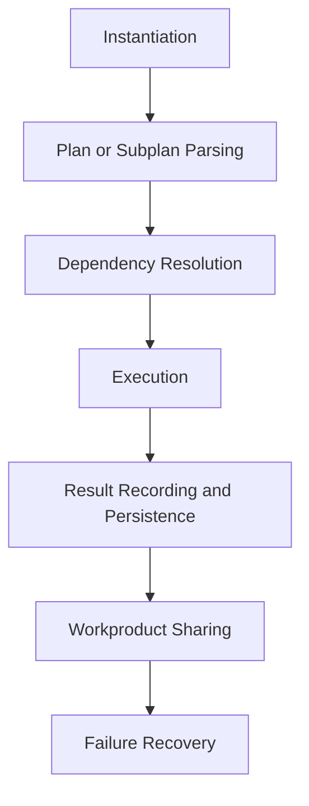
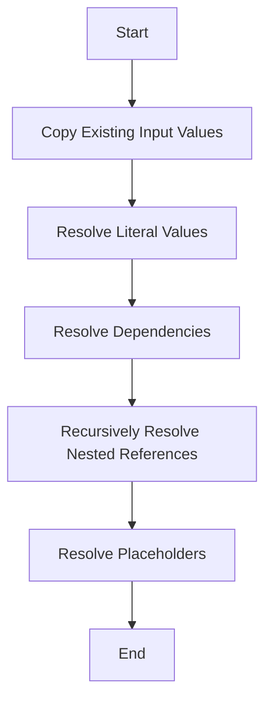
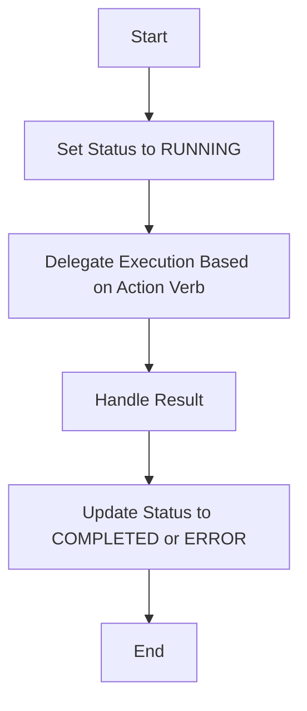

# Step Class Architecture and Implementation

## Table of Contents
1. [Overview](#overview)
2. [Lifecycle of a Step Instance](#lifecycle-of-a-step-instance)
3. [Dependency Resolution Mechanisms](#dependency-resolution-mechanisms)
4. [Execution Orchestration](#execution-orchestration)
5. [Result Recording and Persistence Strategies](#result-recording-and-persistence-strategies)
6. [Workproduct Sharing Protocols](#workproduct-sharing-protocols)
7. [Failure Recovery Workflows](#failure-recovery-workflows)
8. [Architectural Context](#architectural-context)
9. [Diagrams and Sequence Flows](#diagrams-and-sequence-flows)
10. [Edge Cases and Error Handling](#edge-cases-and-error-handling)
11. [State Transitions](#state-transitions)
12. [Data Flow Patterns](#data-flow-patterns)
13. [Integration Touchpoints](#integration-touchpoints)

## Overview
The `Step` class is a core component of the agent architecture, responsible for managing individual tasks within a mission. It encapsulates the logic for task execution, dependency resolution, and state management. The class is designed to handle a wide range of action verbs, including control flow operations like `DECIDE`, `REPEAT`, `FOREACH`, and `DELEGATE`.

### Key Features
- **Dependency Management**: Resolves dependencies between steps, including cross-agent dependencies.
- **Execution Orchestration**: Manages the execution of steps, including internal control flow verbs and external plugin actions.
- **State Management**: Tracks the status of steps through various states such as `PENDING`, `RUNNING`, `COMPLETED`, and `ERROR`.
- **Persistence**: Records step execution events and results for persistence and recovery.
- **Error Handling**: Implements robust error handling and recovery mechanisms, including retry logic and reflection-based solution regeneration.

## Lifecycle of a Step Instance

### 1. Instantiation
The lifecycle of a `Step` instance begins with its instantiation. The constructor initializes the step with various parameters, including:
- `actionVerb`: The action to be performed (e.g., `THINK`, `DELEGATE`, `FOREACH`).
- `inputReferences` and `inputValues`: Inputs required for the step's execution.
- `dependencies`: Other steps that this step depends on.
- `persistenceManager` and `crossAgentResolver`: Utilities for persistence and cross-agent dependency resolution.

```typescript
constructor(params: {
    parentStepId?: string,
    id?: string,
    templateId?: string,
    scope_id?: string,
    missionId?: string,
    ownerAgentId?: string,
    actionVerb: string,
    inputReferences?: Map<string, InputReference>,
    inputValues?: Map<string, InputValue>,
    description?: string,
    dependencies?: StepDependency[],
    outputs?: Map<string, string>,
    originalOutputDefinitions?: Map<string, any>,
    status?: StepStatus,
    result?: PluginOutput[],
    recommendedRole?: string,
    persistenceManager: AgentPersistenceManager,
    maxRetries?: number,
    maxRecoverableRetries?: number
    currentOwnerAgentId?: string;
    delegatingAgentId?: string;
    delegationHistory?: DelegationRecord[];
    lastOwnershipChange?: string;
    crossAgentResolver: CrossAgentDependencyResolver;
})
```

### 2. Plan or Subplan Parsing
Steps can be created from a plan or subplan using the `createFromPlan` function. This function parses the plan and creates step instances, wiring up dependencies and input references.

```typescript
export function createFromPlan(
    plan: ActionVerbTask[],
    persistenceManager: AgentPersistenceManager,
    crossAgentResolver: CrossAgentDependencyResolver,
    parentStep?: Step,
    agent?: any
): Step[]
```

### 3. Dependency Resolution
Before execution, the step resolves its dependencies using the `dereferenceInputsForExecution` method. This method:
- Copies existing input values.
- Resolves dependencies on other steps, including cross-agent dependencies.
- Recursively resolves nested input references.
- Resolves placeholders in input values.

```typescript
public async dereferenceInputsForExecution(allSteps: Step[], missionId: string): Promise<Map<string, InputValue>>
```

### 4. Execution
The `execute` method orchestrates the execution of the step. It:
- Sets the step status to `RUNNING`.
- Delegates execution based on the `actionVerb` (e.g., internal control flow verbs, external plugin actions).
- Handles the result, updating the step status to `COMPLETED` or `ERROR` as appropriate.

```typescript
public async execute(
    executeAction: (step: Step) => Promise<PluginOutput[]>,
    thinkAction: (inputValues: Map<string, InputValue>, actionVerb: string) => Promise<PluginOutput[]>,
    delegateAction: (inputValues: Map<string, InputValue>) => Promise<PluginOutput[]>,
    askAction: (inputValues: Map<string, InputValue>) => Promise<PluginOutput[]>,
    allSteps: Step[],
    agent: Agent,
): Promise<PluginOutput[]>
```

### 5. Result Recording and Persistence
The step records execution events and results using the `logEvent` method. This method logs events such as step creation, execution start, execution finish, and errors.

```typescript
async logEvent(event: any): Promise<void>
```

### 6. Workproduct Sharing
The step shares its outputs with dependent steps through the `outputs` map. This map is used to resolve dependencies for other steps.

### 7. Failure Recovery
The step implements robust error handling and recovery mechanisms. If an error occurs during execution, the step:
- Sets the status to `ERROR`.
- Logs the error event.
- Returns an error response.

```typescript
this.status = StepStatus.ERROR;
this.lastError = error;
this.logEvent({
    eventType: 'step_execution_error',
    stepId: this.id,
    error: errorMessage,
    timestamp: new Date().toISOString()
});
```

## Dependency Resolution Mechanisms

### Input Resolution
The `dereferenceInputsForExecution` method resolves inputs for the step. It handles:
- **Literal Values**: Directly copies input values.
- **Dependencies**: Resolves dependencies on other steps, including cross-agent dependencies.
- **Nested References**: Recursively resolves nested input references.
- **Placeholders**: Resolves placeholders in input values.

### Cross-Agent Dependency Resolution
The `CrossAgentDependencyResolver` is used to resolve dependencies on steps owned by other agents. This is crucial for distributed execution scenarios.

```typescript
const remoteOutput = await this.crossAgentResolver.getStepOutput(dep.sourceStepId, dep.outputName);
```

### Recursive Resolution
The `recursivelyResolveInputReferences` method handles nested input references. It:
- Recursively processes arrays and objects.
- Resolves `InputReference` structures.
- Handles special cases such as `sourceStep: '0'` for parent-provided dependencies.

```typescript
private async recursivelyResolveInputReferences(
    value: any,
    allSteps: Step[],
    inputRunValues: Map<string, InputValue>,
    expectedValueType?: PluginParameterType,
    currentInputName?: string
): Promise<any>
```

## Execution Orchestration

### Internal Control Flow Verbs
The step handles several internal control flow verbs:
- **DECIDE**: Evaluates a condition and executes the appropriate branch.
- **REPEAT**: Repeats a set of steps a specified number of times.
- **FOREACH**: Executes a set of steps for each item in an array.
- **WHILE**: Executes a set of steps while a condition is true.
- **UNTIL**: Executes a set of steps until a condition is true.
- **SEQUENCE**: Executes a sequence of steps in order.
- **REGROUP**: Aggregates results from multiple steps.
- **TIMEOUT**: Executes a set of steps with a timeout.

### External Plugin Actions
For external plugin actions, the step delegates execution to the provided `executeAction` function.

```typescript
default:
    result = await executeAction(this);
    break;
```

### Delegation
The step supports delegation to other agents through the `DELEGATE` action verb. This involves creating sub-agents and managing their execution.

```typescript
case 'DELEGATE':
    result = await delegateAction(this.inputValues);
    break;
```

## Result Recording and Persistence Strategies

### Event Logging
The step logs various events throughout its lifecycle:
- **Step Creation**: Logged when the step is instantiated.
- **Execution Start**: Logged when the step starts execution.
- **Execution Finish**: Logged when the step completes execution.
- **Execution Error**: Logged when the step encounters an error.

```typescript
this.logEvent({
    eventType: 'step_execution_start',
    stepId: this.id,
    actionVerb: this.actionVerb,
    timestamp: new Date().toISOString()
});
```

### Result Persistence
The step persists its results using the `AgentPersistenceManager`. This ensures that results are available for recovery and retry scenarios.

```typescript
const persisted = await this.persistenceManager.loadStepWorkProduct(possibleAgentId, sourceStep.id);
```

## Workproduct Sharing Protocols

### Output Mapping
The step maps plugin outputs to custom names defined in the plan. This ensures that outputs are correctly named and can be referenced by dependent steps.

```typescript
public async mapPluginOutputsToCustomNames(pluginOutputs: PluginOutput[]): Promise<PluginOutput[]>
```

### Deliverable Outputs
The step identifies deliverable outputs based on the `originalOutputDefinitions`. This is used to determine which outputs should be shared with dependent steps.

```typescript
public hasDeliverableOutputs(): boolean
```

## Failure Recovery Workflows

### Error Handling
The step implements robust error handling:
- **Error Logging**: Logs errors for debugging and recovery.
- **Error Responses**: Returns standardized error responses.
- **Retry Logic**: Supports retry logic for recoverable errors.

```typescript
this.status = StepStatus.ERROR;
this.lastError = error;
this.logEvent({
    eventType: 'step_execution_error',
    stepId: this.id,
    error: errorMessage,
    timestamp: new Date().toISOString()
});
```

### Reflection-Based Solution Regeneration
The step supports reflection-based solution regeneration through the `triggerReflection` method. This is used to recover from errors by generating new solutions.

```typescript
private async triggerReflection(executeAction: (step: Step) => Promise<PluginOutput[]>): Promise<void>
```

## Architectural Context

### Agent Architecture Patterns
The `Step` class aligns with several agent architecture patterns:
- **Task Decomposition**: Breaks down complex tasks into smaller, manageable steps.
- **Dependency Management**: Manages dependencies between steps, including cross-agent dependencies.
- **State Management**: Tracks the status of steps through various states.
- **Persistence**: Records step execution events and results for recovery and retry scenarios.

### Integration with Agent Ecosystem
The `Step` class integrates with various components of the agent ecosystem:
- **AgentPersistenceManager**: For persistence and recovery.
- **CrossAgentDependencyResolver**: For cross-agent dependency resolution.
- **Agent**: For delegation and execution orchestration.
- **CapabilitiesManager**: For runtime FOREACH detection and other capabilities.

## Diagrams and Sequence Flows

### Step Lifecycle Diagram


### Dependency Resolution Flow


### Execution Orchestration Flow


## Edge Cases and Error Handling

### Missing Inputs
The step handles missing inputs by logging warnings and setting the status to `ERROR`.

```typescript
if (!stepsInput) {
    throw new Error('Missing required input: steps');
}
```

### Invalid JSON
The step handles invalid JSON by logging errors and setting the status to `ERROR`.

```typescript
try {
    steps = JSON.parse(stepsInput.value);
} catch (e) {
    throw new Error('Invalid JSON format for steps');
}
```

### Dependency Resolution Failures
The step handles dependency resolution failures by logging errors and setting the status to `ERROR`.

```typescript
catch (error) {
    const errorMessage = error instanceof Error ? error.message : String(error);
    console.error(`[Step ${this.id}] Failed to resolve input '${dep.inputName}': ${errorMessage}`);
    resolved.set(`__failed_${dep.inputName}`, { inputName: `__failed_${dep.inputName}`, value: undefined, valueType: PluginParameterType.ERROR });
}
```

## State Transitions

### Status Enumeration
The `StepStatus` enumeration defines the possible states of a step:
- `PENDING`: The step is waiting to be executed.
- `RUNNING`: The step is currently executing.
- `COMPLETED`: The step has completed successfully.
- `ERROR`: The step encountered an error.
- `PAUSED`: The step is paused.
- `CANCELLED`: The step was cancelled.
- `WAITING`: The step is waiting for a signal.
- `REPLACED`: The step was replaced by another step.

```typescript
export enum StepStatus {
    PENDING = 'pending',
    RUNNING = 'running',
    COMPLETED = 'completed',
    ERROR = 'error',
    PAUSED = 'paused',
    CANCELLED = 'cancelled',
    WAITING = 'waiting',
    REPLACED = 'replaced',
}
```

### State Transition Logic
The step transitions between states based on its execution status:
- **PENDING to RUNNING**: When the step starts execution.
- **RUNNING to COMPLETED**: When the step completes successfully.
- **RUNNING to ERROR**: When the step encounters an error.
- **RUNNING to WAITING**: When the step is waiting for a signal.
- **RUNNING to REPLACED**: When the step is replaced by another step.

## Data Flow Patterns

### Input Flow
Inputs flow into the step through:
- **Literal Values**: Directly provided input values.
- **Dependencies**: Resolved from other steps, including cross-agent dependencies.
- **Nested References**: Recursively resolved nested input references.
- **Placeholders**: Resolved from other steps' outputs.

### Output Flow
Outputs flow out of the step through:
- **Result Mapping**: Plugin outputs are mapped to custom names defined in the plan.
- **Deliverable Outputs**: Identified based on the `originalOutputDefinitions`.
- **Workproduct Sharing**: Outputs are shared with dependent steps through the `outputs` map.

## Integration Touchpoints

### AgentPersistenceManager
The `AgentPersistenceManager` is used for:
- **Event Logging**: Logging step execution events.
- **Result Persistence**: Persisting step results for recovery and retry scenarios.
- **Step Loading**: Loading step data for dependency resolution.

```typescript
this.persistenceManager = params.persistenceManager;
```

### CrossAgentDependencyResolver
The `CrossAgentDependencyResolver` is used for:
- **Cross-Agent Dependency Resolution**: Resolving dependencies on steps owned by other agents.
- **Remote Step Details**: Retrieving details of steps owned by other agents.

```typescript
this.crossAgentResolver = params.crossAgentResolver;
```

### Agent
The `Agent` is used for:
- **Delegation**: Delegating execution to other agents.
- **Execution Orchestration**: Orchestrating the execution of steps.
- **Step Registration**: Registering steps with the agent.

```typescript
if (agent) {
    agent.agentSet.registerStepLocation(step.id, agent.id, agent.agentSetUrl);
}
```

### CapabilitiesManager
The `CapabilitiesManager` is used for:
- **Runtime FOREACH Detection**: Detecting if upcoming steps need FOREACH wrapping based on step outputs.

```typescript
static async detectRuntimeForeachNeeds(
    executedStep: Step,
    stepOutputs: Record<string, any>,
    upcomingSteps: Step[]
): Promise<ForeachModification[]>
```

## Conclusion
The `Step` class is a critical component of the agent architecture, responsible for managing individual tasks within a mission. It encapsulates the logic for task execution, dependency resolution, and state management. The class is designed to handle a wide range of action verbs, including control flow operations and external plugin actions. Its robust error handling and recovery mechanisms ensure reliable execution, while its integration with the agent ecosystem enables distributed execution scenarios.