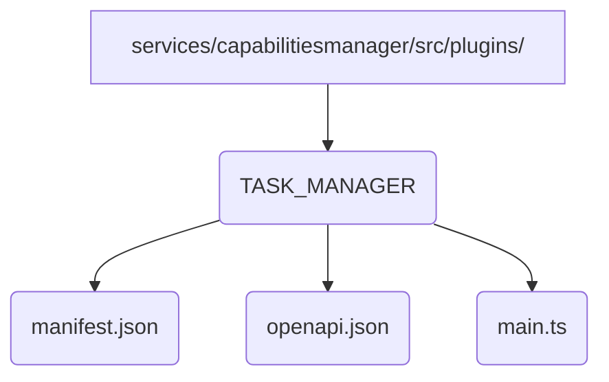

# TASK_MANAGER Plugin Design

## 1. Overview

The `TASK_MANAGER` plugin provides agents with the ability to perform self-planning, create and manage subtasks, and track their progress. This functionality is essential for enabling agents to handle complex, multi-step problems by breaking them down into smaller, manageable units of work.

## 2. File Structure

The plugin will be located in `services/capabilitiesmanager/src/plugins/TASK_MANAGER/` and will have the following structure:



*   **`manifest.json`**: Defines the plugin's metadata, including its ID, verb, and I/O definitions.
*   **`openapi.json`**: Provides the OpenAPI specification for the plugin's API.
*   **`main.ts`**: Contains the core implementation of the plugin's logic in TypeScript.

## 3. Data Persistence

Task data will be persisted using the central `librarian` service. This approach ensures that task data is stored reliably and is accessible to the agent across different sessions and instances. The `TASK_MANAGER` plugin will interact with the `librarian` service to store and retrieve a single JSON object that represents the entire task list. The key for this object will be `task-manager-tasks`.

The data structure for tasks will be as follows:

```json
{
  "tasks": [
    {
      "id": "task_1",
      "goal": "High-level goal for the main task",
      "status": "pending" | "in_progress" | "completed" | "failed",
      "subtasks": [
        {
          "id": "subtask_1.1",
          "goal": "A smaller, actionable step",
          "status": "pending" | "in_progress" | "completed" | "failed"
        }
      ]
    }
  ]
}
```

## 4. `manifest.json`

```json
{
  "id": "plugin-TASK_MANAGER",
  "verb": "TASK_MANAGER",
  "description": "A plugin for self-planning, creating, and managing tasks and subtasks.",
  "explanation": "This plugin allows an agent to break down a large goal into a series of smaller, manageable steps and track their status.",
  "language": "typescript",
  "entryPoint": {
    "main": "main.ts",
    "function": "execute"
  },
  "repository": {
    "type": "local"
  },
  "security": {
    "permissions": [
      "librarian.read",
      "librarian.write"
    ]
  },
  "version": "1.0.0",
  "metadata": {
    "author": "Stage7 Development Team",
    "tags": ["task", "planning", "management", "subtask"],
    "category": "agent"
  }
}
```

## 5. `openapi.json`

```json
{
  "openapi": "3.0.0",
  "info": {
    "title": "TASK_MANAGER Plugin API",
    "version": "1.0.0",
    "description": "API for creating and managing tasks and subtasks."
  },
  "paths": {
    "/create_task": {
      "post": {
        "summary": "Create a new main task",
        "operationId": "create_task",
        "requestBody": {
          "required": true,
          "content": {
            "application/json": {
              "schema": {
                "type": "object",
                "properties": {
                  "goal": {
                    "type": "string",
                    "description": "The high-level goal of the task."
                  }
                },
                "required": ["goal"]
              }
            }
          }
        },
        "responses": {
          "200": {
            "description": "Task created successfully.",
            "content": {
              "application/json": {
                "schema": {
                  "type": "object",
                  "properties": {
                    "task_id": {
                      "type": "string"
                    }
                  }
                }
              }
            }
          }
        }
      }
    },
    "/create_subtask": {
      "post": {
        "summary": "Create a new subtask",
        "operationId": "create_subtask",
        "requestBody": {
          "required": true,
          "content": {
            "application/json": {
              "schema": {
                "type": "object",
                "properties": {
                  "parent_task_id": {
                    "type": "string",
                    "description": "The ID of the parent task."
                  },
                  "goal": {
                    "type": "string",
                    "description": "The goal of the subtask."
                  }
                },
                "required": ["parent_task_id", "goal"]
              }
            }
          }
        },
        "responses": {
          "200": {
            "description": "Subtask created successfully.",
            "content": {
              "application/json": {
                "schema": {
                  "type": "object",
                  "properties": {
                    "subtask_id": {
                      "type": "string"
                    }
                  }
                }
              }
            }
          }
        }
      }
    },
    "/update_task_status": {
      "post": {
        "summary": "Update the status of a task or subtask",
        "operationId": "update_task_status",
        "requestBody": {
          "required": true,
          "content": {
            "application/json": {
              "schema": {
                "type": "object",
                "properties": {
                  "task_id": {
                    "type": "string",
                    "description": "The ID of the task or subtask."
                  },
                  "status": {
                    "type": "string",
                    "enum": ["pending", "in_progress", "completed", "failed"]
                  }
                },
                "required": ["task_id", "status"]
              }
            }
          }
        },
        "responses": {
          "200": {
            "description": "Status updated successfully."
          }
        }
      }
    },
    "/get_task_list": {
      "get": {
        "summary": "Get the list of all tasks and subtasks",
        "operationId": "get_task_list",
        "responses": {
          "200": {
            "description": "A list of tasks.",
            "content": {
              "application/json": {
                "schema": {
                  "type": "object",
                  "properties": {
                    "tasks": {
                      "type": "array",
                      "items": {
                        "$ref": "#/components/schemas/Task"
                      }
                    }
                  }
                }
              }
            }
          }
        }
      }
    }
  },
  "components": {
    "schemas": {
      "Task": {
        "type": "object",
        "properties": {
          "id": { "type": "string" },
          "goal": { "type": "string" },
          "status": { "type": "string" },
          "subtasks": {
            "type": "array",
            "items": {
              "$ref": "#/components/schemas/Subtask"
            }
          }
        }
      },
      "Subtask": {
        "type": "object",
        "properties": {
          "id": { "type": "string" },
          "goal": { "type": "string" },
          "status": { "type": "string" }
        }
      }
    }
  }
}
```

## 6. High-Level Logic for `main.ts`

The `main.ts` file will implement the logic for each of the API endpoints defined in `openapi.json`. It will use a helper function to interact with the `librarian` service for all data operations.

### Core Functions:

*   **`getTasks()`**: Retrieves the task list from the `librarian` service. If no data exists, it returns an empty task list.
*   **`saveTasks(tasks)`**: Saves the provided task list to the `librarian` service.

### Endpoint Logic:

*   **`create_task(goal)`**:
    1.  Calls `getTasks()` to fetch the current task list.
    2.  Generates a unique ID for the new task (e.g., `task_${timestamp}`).
    3.  Adds the new task to the list with a `pending` status.
    4.  Calls `saveTasks()` to persist the updated list.
    5.  Returns the new task's ID.

*   **`create_subtask(parent_task_id, goal)`**:
    1.  Calls `getTasks()` to fetch the current task list.
    2.  Finds the parent task by its ID.
    3.  Generates a unique ID for the new subtask (e.g., `${parent_task_id}.${subtask_index}`).
    4.  Adds the new subtask to the parent's `subtasks` array with a `pending` status.
    5.  Calls `saveTasks()` to persist the updated list.
    6.  Returns the new subtask's ID.

*   **`update_task_status(task_id, status)`**:
    1.  Calls `getTasks()` to fetch the current task list.
    2.  Searches for the task or subtask by its ID across all tasks and their subtasks.
    3.  Updates the status of the found task/subtask.
    4.  Calls `saveTasks()` to persist the updated list.

*   **`get_task_list()`**:
    1.  Calls `getTasks()` to fetch and return the complete task list.