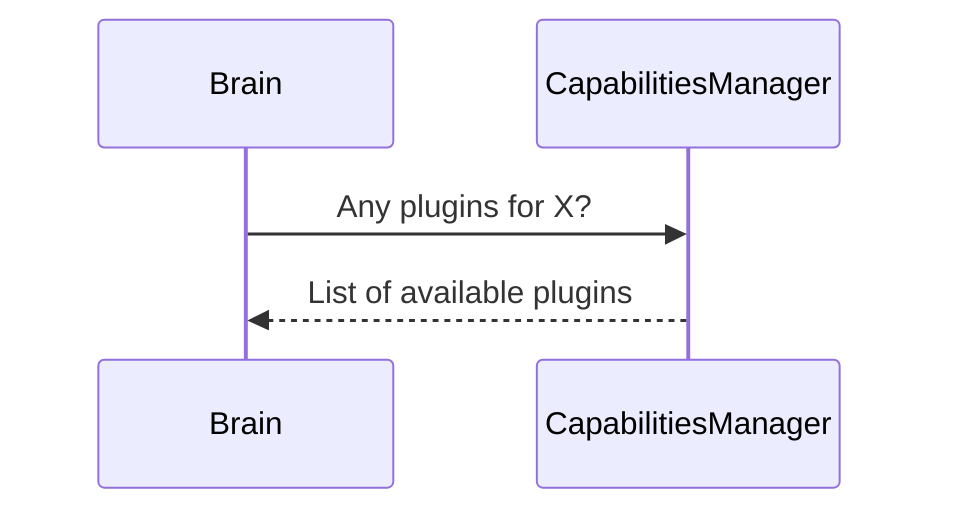
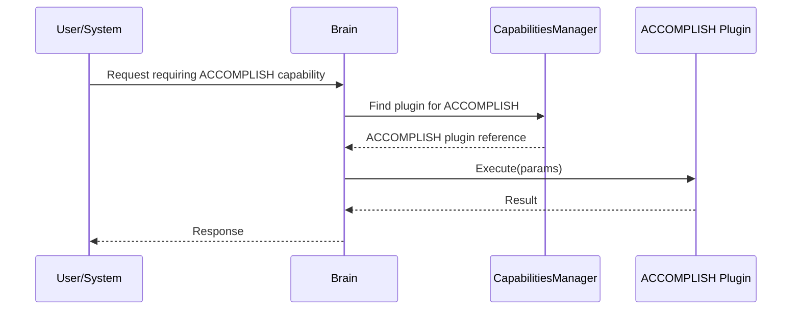
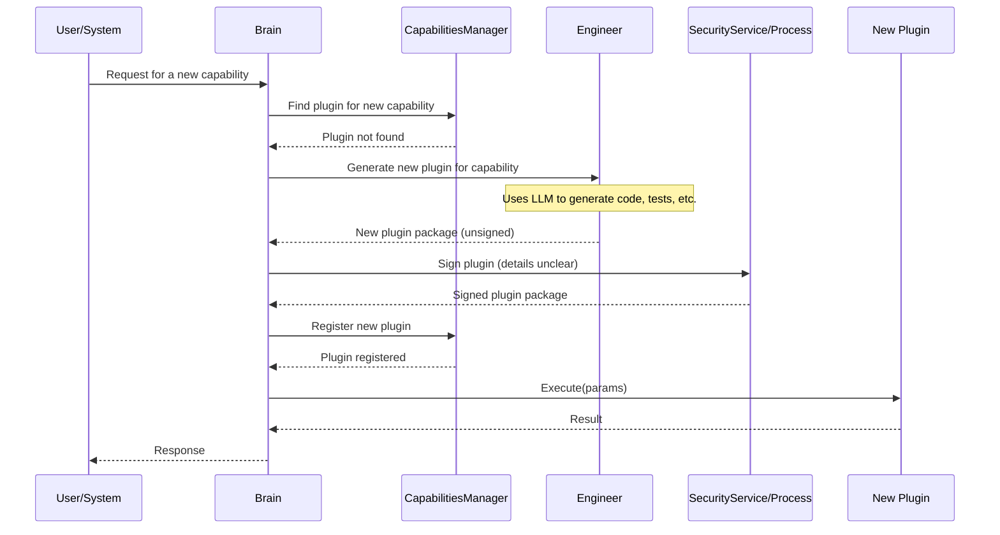
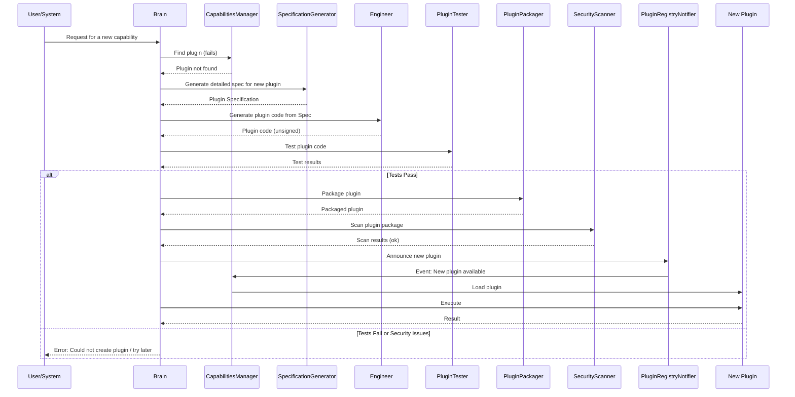
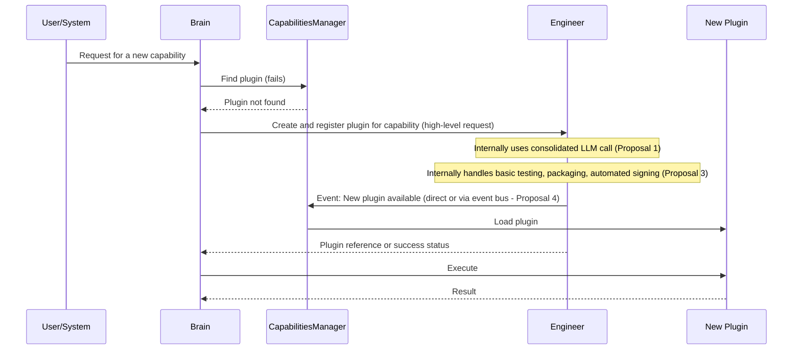

# Architecture Simplification Proposal

This document outlines the current (hypothesized) plugin workflow and proposes architectural simplifications to reduce complexity, improve maintainability, and enhance efficiency.

## 1. Current Plugin Workflow (Hypothesized)

The current system appears to involve several key components: `CapabilitiesManager`, the `ACCOMPLISH` plugin (as an example of a capability), the `Brain` service, and the `Engineer` service.

**Interactions:**

*   **`Brain` Service:** Acts as the central orchestrator. Receives requests requiring specific capabilities.
*   **`CapabilitiesManager`:** Responsible for plugin discovery (finding available plugins) and potentially managing their lifecycle (loading/unloading).
*   **`ACCOMPLISH` Plugin (and other plugins):** Provides specific functionalities. Registered with and discoverable by `CapabilitiesManager`.
*   **`Engineer` Service:** Tasked with creating new plugins when the `Brain` service identifies a need for a capability that doesn't exist.

**Flows:**

### a. Plugin Discovery

*   **Process:**
    1.  `CapabilitiesManager` scans a plugin directory or a registry at startup or periodically.
    2.  It identifies and registers available plugins, including their capabilities.

### b. Plugin Execution (e.g., executing ACCOMPLISH plugin)

*   **Process:**
    1.  A request arrives at the `Brain` service.
    2.  `Brain` queries `CapabilitiesManager` for a plugin that can handle the request.
    3.  `CapabilitiesManager` returns a reference to the appropriate plugin (e.g., `ACCOMPLISH`).
    4.  `Brain` invokes the plugin.
    5.  The plugin executes its logic and returns the result to `Brain`.

### c. New Plugin Creation (When a capability is missing)

*   **Process:**
    1.  `Brain` determines no existing plugin can handle a request.
    2.  `Brain` instructs `Engineer` service to create a new plugin.
    3.  `Engineer` service (potentially using multiple LLM calls and complex logic) generates the plugin code, metadata, and possibly tests.
    4.  The generated plugin (raw, "unsigned") is returned to `Brain`.
    5.  A "signing" process occurs. This could involve security vetting, packaging, or formal registration. The exact nature is unclear.
    6.  The signed plugin is then made available to `CapabilitiesManager` for discovery and loading.
    7.  `CapabilitiesManager` loads the new plugin.
    8.  The `Brain` can now use this new plugin.

**Highlighted Complexities in Current Flow:**

*   **Multiple LLM Calls:** The `Engineer` service might be making multiple, potentially uncoordinated, LLM calls for code generation, documentation, and testing, leading to inefficiency and higher token costs.
*   **Role of `Engineer` Service:** The `Engineer` service's role might be overly broad, encompassing code generation, testing, and potentially other aspects of plugin development.
*   **Plugin Signing:** The "plugin signing" step is vague. If it's a manual or complex automated step, it can introduce delays and bottlenecks.
*   **Discovery of Newly Created Plugins:** The mechanism for `CapabilitiesManager` to become aware of a newly created and signed plugin might be complex or rely on polling.

## 2. Proposed Architectural Simplifications

The following proposals aim to streamline the plugin architecture, particularly the creation and management aspects.

### Proposal 1: Consolidate LLM Calls for Plugin Creation

*   **Description:** Modify the `Engineer` service (or introduce a new, specialized service) to use a single, well-structured LLM call or a tightly orchestrated sequence of calls for generating a complete plugin package. This package would include code, metadata, documentation, and basic unit tests.
*   **Benefits:**
    *   **Reduced Latency:** Fewer LLM calls can significantly speed up plugin generation.
    *   **Lower Cost:** Consolidating calls can reduce overall token usage.
    *   **Improved Cohesion:** A single generation step is more likely to produce a consistent and complete plugin.
    *   **Simplified Logic:** The `Engineer` service becomes simpler if it's just prompting and parsing, rather than managing many disparate LLM interactions.
*   **Drawbacks/Open Questions:**
    *   **Prompt Complexity:** Crafting a single, comprehensive prompt that generates all necessary artifacts might be challenging.
    *   **LLM Limitations:** The chosen LLM must be capable of generating diverse artifacts (code, docs, tests) in one go or via a structured output format.
    *   **Error Handling:** Managing errors from a single large LLM call might be more complex than from smaller, targeted calls.

### Proposal 2: Clarify and Specialize the `Engineer` Service's Role

*   **Description:** Narrow the `Engineer` service's responsibility primarily to high-quality code generation based on clear specifications from the `Brain`. Other aspects like advanced testing, security scanning, and deployment could be handled by other specialized services or a CI/CD pipeline.
*   **Benefits:**
    *   **Improved Maintainability:** Specialized services are easier to develop, test, and maintain.
    *   **Increased Reusability:** A focused `Engineer` service (as a "code generation engine") can be reused by other parts of the system.
    *   **Clearer Separation of Concerns:** Better aligns with single responsibility principle.
*   **Drawbacks/Open Questions:**
    *   **Increased Inter-service Communication:** More services might lead to more complex communication patterns.
    *   **Orchestration Overhead:** The `Brain` or another component would need to orchestrate these specialized services.

### Proposal 3: Streamline Plugin Signing and Registration

*   **Description:** Define and automate the "plugin signing" process. This could mean:
    *   **Automated Security Scans:** Integrate automated static analysis (SAST) and vulnerability scanning tools directly after plugin generation.
    *   **Standardized Packaging:** Enforce a standard plugin package format.
    *   **Automated Registration:** Once a plugin passes automated checks, it's automatically registered with `CapabilitiesManager` without manual intervention. This could be achieved via an event-driven mechanism or a direct API call from the signing/CI process to `CapabilitiesManager`.
*   **Benefits:**
    *   **Reduced Bottlenecks:** Automation removes manual delays.
    *   **Improved Security:** Consistent, automated security checks.
    *   **Faster Availability:** New plugins become available for use more quickly.
*   **Drawbacks/Open Questions:**
    *   **Trust in Automation:** The automated checks must be robust and reliable.
    *   **Complexity of Automation:** Setting up a fully automated signing and registration pipeline can be complex initially.

### Proposal 4: Event-Driven Plugin Discovery

*   **Description:** Instead of `CapabilitiesManager` polling for new plugins, implement an event-driven mechanism. When a new plugin is successfully created and signed, an event is published (e.g., to a message queue). `CapabilitiesManager` subscribes to these events and loads new plugins as they are announced.
*   **Benefits:**
    *   **Reduced Latency:** `CapabilitiesManager` becomes aware of new plugins almost instantly.
    *   **Improved Efficiency:** Eliminates polling, reducing unnecessary load on the system.
    *   **Scalability:** Event-driven architectures are generally more scalable.
*   **Drawbacks/Open Questions:**
    *   **Infrastructure Overhead:** Requires a message bus/event streaming platform.
    *   **Complexity:** Adds asynchronous communication, which can be harder to debug.

## 3. "New Plugin Required" Scenario - Proposed Options

This section details two options for handling the scenario where the `Brain` service determines a new plugin needs to be created.

### Option A: `Brain` Orchestrates, `Engineer` Generates (Focus on Specialization)

*   **Description:**
    1.  `Brain` identifies the need and uses a dedicated internal component/service (`SpecificationGenerator`) to create a detailed specification for the new plugin (inputs, outputs, core logic description).
    2.  `Brain` sends this specification to a specialized `Engineer` service whose sole responsibility is to generate high-quality code based on the spec (Proposal 2).
    3.  The generated code is then passed through a pipeline of other specialized services orchestrated by `Brain`:
        *   `PluginTester`: Runs automated tests.
        *   `PluginPackager`: Packages the plugin in a standard format.
        *   `SecurityScanner`: Performs security checks (part of Proposal 3).
    4.  If all steps pass, `Brain` notifies `PluginRegistryNotifier` which in turn informs `CapabilitiesManager` (event-driven, Proposal 4).
    5.  `CapabilitiesManager` loads the new plugin.

*   **Benefits:**
    *   **High Specialization:** Each component does one thing well.
    *   **Testability:** Easier to test individual components of the creation pipeline.
    *   **Flexibility:** Easier to swap out or upgrade individual components (e.g., use a different testing service).
*   **Drawbacks:**
    *   **Orchestration Complexity:** `Brain` takes on significant orchestration logic.
    *   **Potential Latency:** Multiple handoffs between services could introduce latency if not optimized.

### Option B: `Engineer` as a "Plugin Factory" (Focus on Consolidation)

*   **Description:**
    1.  `Brain` identifies the need and sends a high-level request to the `Engineer` service to create a plugin for the specified capability.
    2.  The `Engineer` service is now a more comprehensive "Plugin Factory." It internally:
        *   Refines the requirements if necessary.
        *   Uses a consolidated LLM call to generate code, basic tests, and documentation (Proposal 1).
        *   Performs automated testing.
        *   Packages the plugin.
        *   Performs automated "signing" (e.g., security checks, metadata validation) (Proposal 3).
    3.  Once the plugin is successfully built and passes all internal checks, `Engineer` directly notifies `CapabilitiesManager` (e.g., via an event - Proposal 4) or registers it.
    4.  `Engineer` returns a success status or a reference to the new plugin to `Brain`.

*   **Benefits:**
    *   **Simplified `Brain` Logic:** `Brain` delegates the entire plugin creation process.
    *   **Reduced Latency:** Fewer external service hops if `Engineer` handles most steps internally.
    *   **Encapsulation:** The complexities of plugin generation are hidden within the `Engineer` service.
*   **Drawbacks:**
    *   **Monolithic `Engineer`:** `Engineer` service becomes more complex and harder to maintain.
    *   **Less Flexibility:** Harder to customize individual steps of the plugin creation process (e.g., use a specialized external testing tool).
    *   **Error Handling Complexity:** A failure within the `Engineer`'s internal pipeline might be harder for `Brain` to diagnose and handle gracefully.

## 4. Conclusion and Next Steps

The proposed simplifications aim to create a more robust, efficient, and maintainable plugin architecture. Option A offers greater specialization and flexibility, while Option B prioritizes consolidation and simplifies the `Brain`'s role.

**Next Steps:**

*   Gather feedback on these proposals.
*   Evaluate the capabilities of existing LLMs to support Proposal 1.
*   Detail the exact requirements for the "plugin signing" process.
*   Prototype the chosen "New Plugin Required" option.
