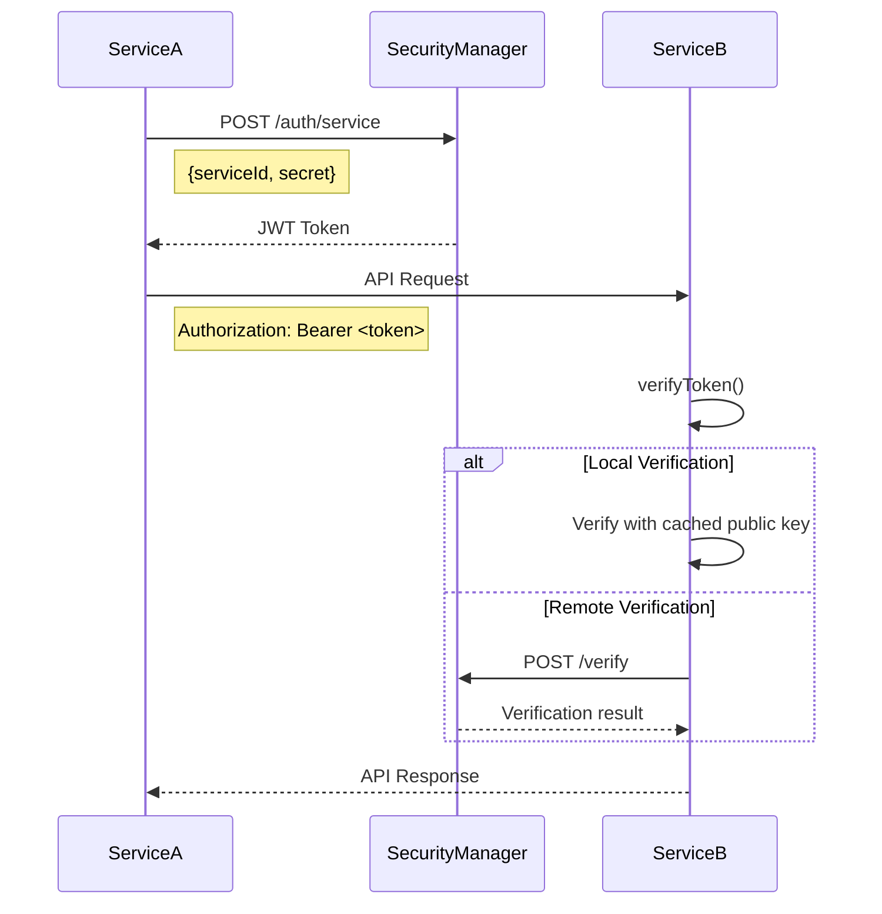
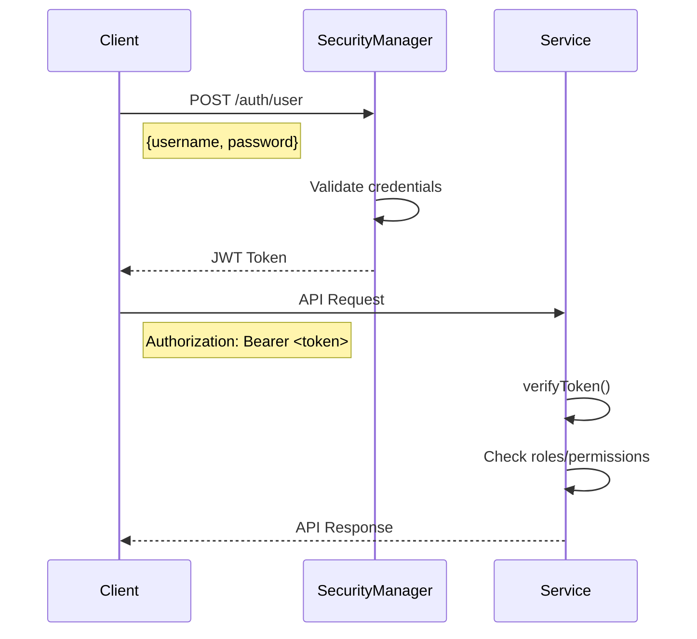
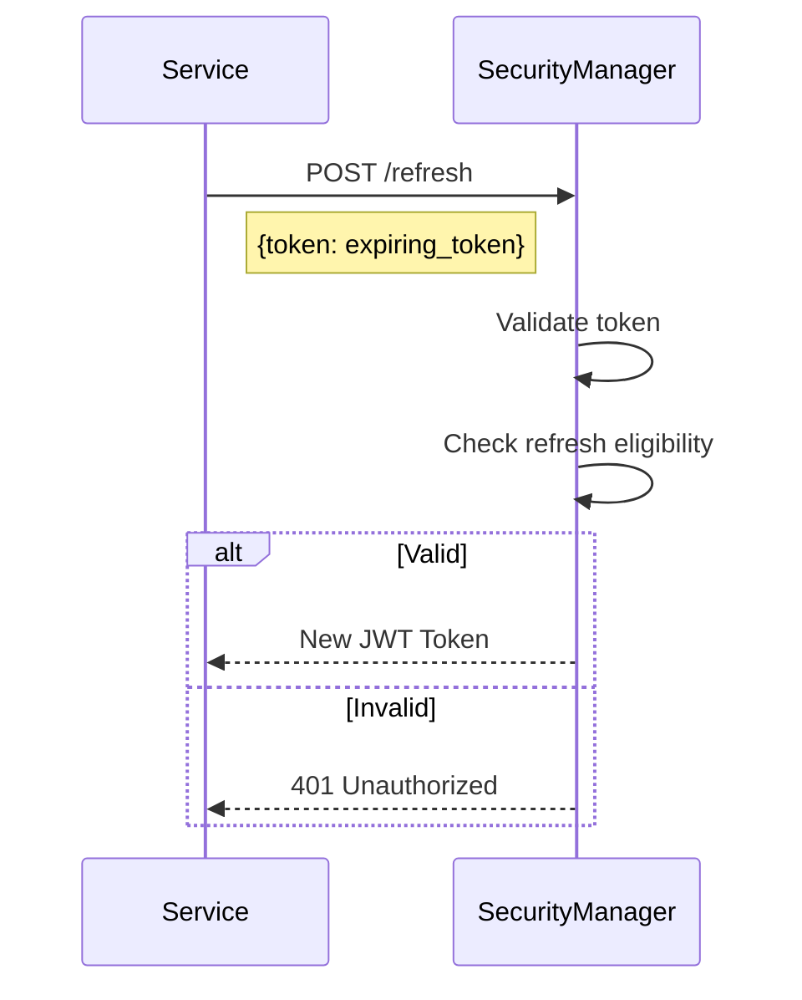
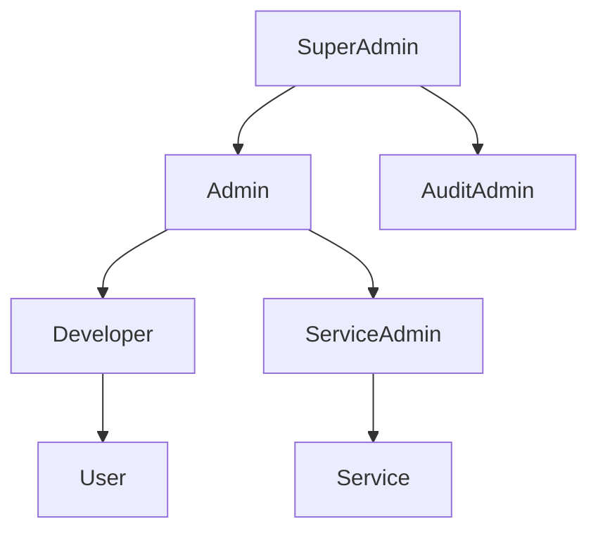
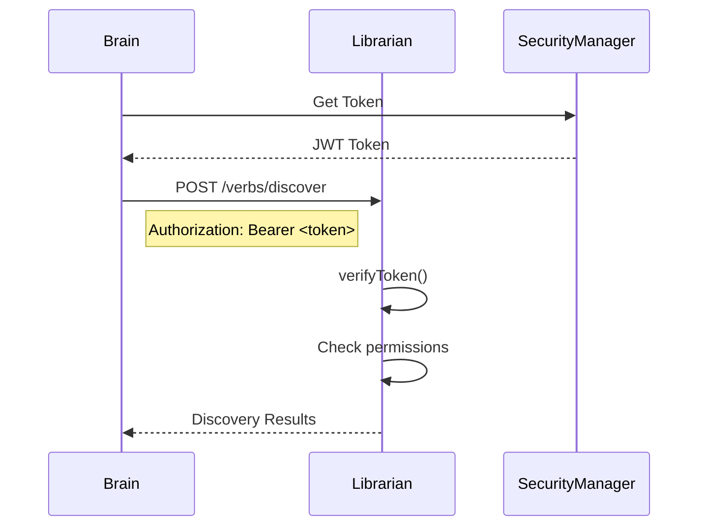
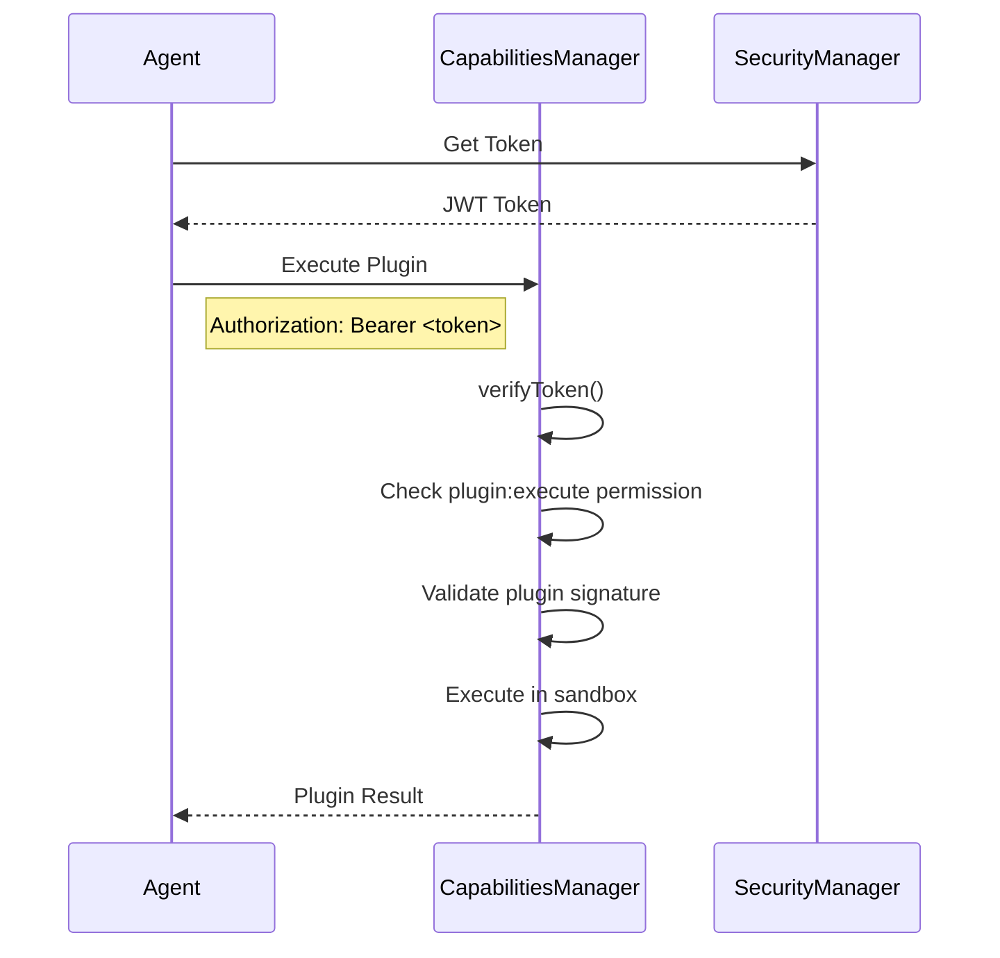
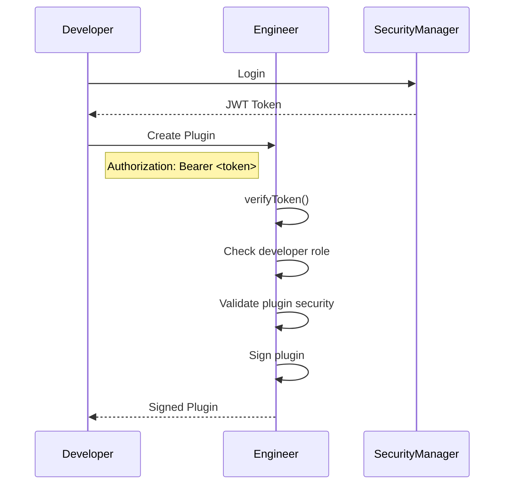

# Authentication and Authorization System

**Status:** Active | **Last Updated:** 2025-12-23 | **Version:** 2.1

This document provides a comprehensive and technically accurate overview of the authentication and authorization system used in the Stage7 platform, including recent improvements and integration with the consolidated architecture.

## 1. Overview

The Stage7 platform uses a centralized authentication service, the `SecurityManager`, to issue JSON Web Tokens (JWTs) for both service-to-service and user authentication. The system is built on the **RS256 (RSA Signature with SHA-256)** asymmetric algorithm, which uses a private key for signing tokens and a public key for verification.

**Key Security Principles:**
- **Asymmetric Cryptography**: Only the `SecurityManager` can issue valid tokens
- **Decentralized Verification**: Any service can verify token authenticity without private key access
- **Short-Lived Tokens**: Tokens expire after 1 hour by default
- **Comprehensive RBAC**: Fine-grained access control based on roles and permissions

## 2. Architecture

The authentication system consists of the following key components:

### 2.1. SecurityManager Service

A central microservice (`services/security`) responsible for:

* **Authentication Services**:
  - Service authentication with shared secrets
  - User authentication with credentials
  - Token generation and signing
  - Token verification endpoint

* **Key Management**:
  - RSA key pair generation and storage
  - Public key distribution
  - Key rotation support

* **Service Registry**:
  - Registered service management
  - Credential validation
  - Service metadata storage

* **Security APIs**:
  - `/auth/service`: Service authentication
  - `/auth/user`: User authentication
  - `/verify`: Token verification
  - `/public-key`: Public key distribution
  - `/refresh`: Token refresh

### 2.2. ServiceTokenManager

A shared utility class (`@cktmcs/shared/ServiceTokenManager`) used by all services:

**Core Responsibilities:**
- **Token Acquisition**: Request tokens from SecurityManager
- **Token Caching**: In-memory cache with configurable TTL
- **Token Refresh**: Proactive refresh before expiration
- **Token Verification**: Multi-step verification process
- **Public Key Management**: Fetch and cache public keys

**Key Methods:**
```typescript
// Get or refresh a valid token
async getToken(): Promise<string>

// Verify token authenticity
async verifyToken(token: string): Promise<JwtPayload>

// Refresh expiring tokens
async refreshToken(): Promise<string>

// Fetch and cache public key
async fetchPublicKey(): Promise<string>
```

### 2.3. BaseEntity

A base class that all services extend, providing common authentication functionality:

**Authentication Features:**
- `verifyToken()`: Middleware for Express route protection
- `getAuthMiddleware()`: Create reusable authentication middleware
- `ensureAuthenticated()`: Utility for manual authentication checks
- `getCurrentUser()`: Extract user information from requests

### 2.4. Authentication Middleware

Reusable Express middleware for route protection:

**Available Middleware:**
- `createAuthMiddleware(entity: BaseEntity)`: Basic token verification
- `requireRoles(roles: string[])`: Role-based access control
- `requirePermissions(permissions: string[])`: Permission-based access control
- `requireAnyRole(roles: string[])`: Any of specified roles
- `requireAllPermissions(permissions: string[])`: All specified permissions

## 3. Authentication Flow

### 3.1. Service-to-Service Authentication (UPDATED)



**Detailed Flow:**

1. **Service Startup**: When a service starts, its `ServiceTokenManager` requests a token
2. **Credential Validation**: SecurityManager validates service credentials against registry
3. **Token Generation**: SecurityManager generates JWT signed with private key
4. **Token Caching**: Service caches the token with expiration tracking
5. **API Requests**: Service attaches token to `Authorization` header
6. **Token Verification**: Receiving service verifies token signature and claims
7. **Access Control**: Middleware checks roles/permissions if required
8. **Token Refresh**: ServiceTokenManager proactively refreshes expiring tokens

### 3.2. User Authentication (UPDATED)



**Detailed Flow:**

1. **User Login**: Client sends credentials to SecurityManager
2. **Credential Validation**: SecurityManager validates against user database
3. **Token Generation**: SecurityManager generates JWT with user claims
4. **Token Storage**: Client stores token securely (HttpOnly cookies recommended)
5. **API Requests**: Client includes token in `Authorization` header
6. **Token Verification**: Service verifies token and extracts user information
7. **Access Control**: Middleware enforces role/permission requirements
8. **Token Refresh**: Client requests new token when expired

## 4. Token Management (UPDATED)

### 4.1. JWT Token Structure

**Standard Claims:**
```json
{
  "iss": "SecurityManager",          // Issuer
  "sub": "user-123|service-456",     // Subject (user or service ID)
  "aud": "stage7-services",          // Audience
  "exp": 1735689600,                  // Expiration (1 hour from issuance)
  "iat": 1735686000,                  // Issued at
  "jti": "abc123-def456-ghi789",     // Unique token ID
  "nbf": 1735686000                   // Not before (optional)
}
```

**Custom Claims:**
```json
{
  "componentType": "Service|User|System",  // Component type
  "componentId": "service-456",            // Specific component ID
  "roles": ["admin", "mission:manage"],   // Assigned roles
  "permissions": [                          // Granular permissions
    "user:create",
    "data:read",
    "plugin:execute"
  ],
  "serviceName": "Brain",                  // For services
  "userEmail": "user@example.com",         // For users
  "sessionId": "session-789"              // Session tracking
}
```

### 4.2. Token Verification Process (UPDATED)

The `ServiceTokenManager.verifyToken()` method implements a robust verification process:

```typescript
async verifyToken(token: string): Promise<JwtPayload> {
    // 1. Cache Check (O(1) lookup)
    const cachedResult = this.tokenCache.get(token);
    if (cachedResult) return cachedResult;
    
    try {
        // 2. Local Verification (preferred - no network call)
        const publicKey = await this.getPublicKey();
        const payload = jwt.verify(token, publicKey, {
            algorithms: ['RS256'],
            audience: 'stage7-services',
            issuer: 'SecurityManager'
        });
        
        // 3. Additional Validation
        this.validateClaims(payload);
        this.tokenCache.set(token, payload);
        return payload;
        
    } catch (error) {
        // 4. Fallback to SecurityManager (network call)
        const response = await this.securityManagerClient.verifyToken(token);
        if (!response.valid) throw new Error('Invalid token');
        
        this.tokenCache.set(token, response.payload);
        return response.payload;
    }
}
```

**Validation Steps:**
1. **Signature Verification**: Validate RS256 signature
2. **Algorithm Check**: Ensure RS256 algorithm used
3. **Issuer Validation**: Confirm token issued by SecurityManager
4. **Audience Validation**: Confirm token intended for Stage7 services
5. **Expiration Check**: Verify token not expired
6. **Not Before Check**: Verify token is valid
7. **Claim Validation**: Validate custom claims structure
8. **Revocation Check**: Verify token not revoked (via SecurityManager)

### 4.3. Token Refresh Mechanism (UPDATED)

**Refresh Token Flow:**


**Refresh Logic:**
- Tokens can be refreshed if within refresh window (last 5 minutes of validity)
- Refresh tokens have same claims but new expiration
- Maximum refresh chain length enforced (prevent infinite refresh)
- Refresh operations are logged for security auditing

### 4.4. Token Revocation (NEW)

**Revocation Mechanisms:**
- **Explicit Revocation**: Admin API to revoke specific tokens
- **User Logout**: Revokes all user tokens
- **Service Decommission**: Revokes all service tokens
- **Security Incident**: Emergency revocation procedure

**Revocation List:**
- Short-term revocation list (last 24 hours)
- Long-term revocation tracking in database
- Efficient lookup for verification

## 5. Key Management (UPDATED)

### 5.1. Key Generation and Storage

**Private Key:**
- **Location**: `services/security/keys/private.key`
- **Permissions**: `600` (owner read/write only)
- **Format**: RSA private key (PKCS#8)
- **Size**: 2048-bit minimum (4096-bit recommended for production)
- **Access**: Only SecurityManager service process

**Public Key:**
- **Location**: `shared/keys/public.key`
- **Permissions**: `644` (owner read/write, group/others read)
- **Format**: RSA public key (PKCS#8)
- **Distribution**: All services that need token verification
- **Access**: All authenticated services

### 5.2. Key Rotation Procedure (NEW)

**Rotation Process:**
```bash
# 1. Generate new key pair
node scripts/generate_keys.js --output=new_keys

# 2. Distribute new public key to all services
node scripts/distribute_public_key.js --key=new_keys/public.key

# 3. Update SecurityManager with new private key
node scripts/update_security_manager.js --key=new_keys/private.key

# 4. Restart services in phases
node scripts/rolling_restart.js --phase=1
sleep 30
node scripts/rolling_restart.js --phase=2

# 5. Verify all services using new keys
node scripts/verify_key_rotation.js

# 6. Archive old keys (keep for 30 days for rollback)
node scripts/archive_keys.js --keys=old_keys
```

**Rotation Frequency:**
- **Development**: Every 3 months
- **Production**: Every 6 months
- **Security Incident**: Immediate rotation

### 5.3. Key Backup and Recovery (NEW)

**Backup Strategy:**
- Encrypted backups of private keys
- Multiple geographic locations
- Access-controlled backup storage
- Regular backup verification
- Documented recovery procedures

**Recovery Process:**
1. Retrieve encrypted backup
2. Decrypt with recovery key
3. Verify key integrity
4. Distribute to SecurityManager
5. Restart authentication services
6. Monitor for anomalies

## 6. Role-Based Access Control (RBAC) (UPDATED)

### 6.1. Role Hierarchy



**Standard Roles:**

| Role | Description | Inherits From |
|------|-------------|---------------|
| `superadmin` | Full system access, including user management | None |
| `admin` | Administrative access to most features | None |
| `developer` | Plugin development and testing access | `user` |
| `user` | Standard user access | None |
| `service` | Service-to-service communication | None |
| `audit` | Read-only access for auditing | None |

**Custom Roles:**
- `mission:manage`: Mission creation and management
- `plugin:admin`: Plugin repository administration
- `data:admin`: Data management and access
- `security:audit`: Security auditing and monitoring

### 6.2. Permission System (UPDATED)

**Permission Categories:**

| Category | Example Permissions | Description |
|----------|---------------------|-------------|
| **User Management** | `user:create`, `user:read`, `user:update`, `user:delete` | User account operations |
| **Mission Management** | `mission:create`, `mission:execute`, `mission:monitor` | Mission lifecycle operations |
| **Plugin Management** | `plugin:create`, `plugin:read`, `plugin:update`, `plugin:delete`, `plugin:execute` | Plugin operations |
| **Data Access** | `data:read`, `data:write`, `data:export`, `data:import` | Data operations |
| **System Administration** | `system:config`, `system:monitor`, `system:maintain` | System operations |
| **Security** | `security:audit`, `security:configure`, `security:monitor` | Security operations |

**Permission Inheritance:**
- Roles can inherit permissions from other roles
- Custom permission sets can be defined
- Permission validation is context-aware

### 6.3. RBAC Implementation (UPDATED)

**Middleware Usage:**
```typescript
// Single role requirement
app.get('/admin', authMiddleware, requireRoles(['admin']), adminController);

// Multiple role requirement (any)
app.get('/config', authMiddleware, requireAnyRole(['admin', 'config:manage']), configController);

// Permission requirement
app.post('/users', authMiddleware, requirePermissions(['user:create']), createUserController);

// Complex requirement
app.delete('/users/:id',
    authMiddleware,
    requireAnyRole(['admin', 'user:admin']),
    requirePermissions(['user:delete']),
    deleteUserController
);
```

**Permission Validation Logic:**
```typescript
function hasPermission(userPermissions: string[], requiredPermissions: string[]): boolean {
    // Check if user has all required permissions
    return requiredPermissions.every(required =>
        userPermissions.includes(required) ||
        userPermissions.includes('*') ||      // Wildcard permission
        userPermissions.some(perm => perm.endsWith(':*') && perm.startsWith(required.split(':')[0]))
    );
}
```

## 7. Implementation Example (UPDATED)

### 7.1. Service Implementation

```typescript
import express from 'express';
import { BaseEntity, createAuthMiddleware, requireRoles, requirePermissions } from '@cktmcs/shared';
import { ServiceTokenManager } from '@cktmcs/security';

class BrainService extends BaseEntity {
  private app: express.Express;
  private tokenManager: ServiceTokenManager;

  constructor() {
    super('brain-service', 'Brain', 'brain', '5030');
    this.app = express();
    this.tokenManager = new ServiceTokenManager(this.id, process.env.BRAIN_SECRET!);
    this.configureRoutes();
    this.configureSecurity();
  }

  private configureSecurity() {
    // Initialize token manager
    this.tokenManager.initialize({
      securityManagerUrl: process.env.SECURITYMANAGER_URL!,
      publicKeyUrl: `${process.env.SECURITYMANAGER_URL}/public-key`,
      tokenCacheTtl: 3600 // 1 hour cache
    });
  }

  private configureRoutes() {
    const authMiddleware = createAuthMiddleware(this);

    // Public health endpoint
    this.app.get('/health', (req, res) => {
      res.json({ status: 'ok', service: 'brain', timestamp: new Date().toISOString() });
    });

    // Protected endpoint - requires valid token
    this.app.get('/status', authMiddleware, async (req, res) => {
      const user = this.getCurrentUser(req);
      const token = await this.tokenManager.getToken();
      
      res.json({
        status: 'authenticated',
        user: user.componentType,
        userId: user.sub,
        serviceToken: token.substring(0, 10) + '...' // Truncated for security
      });
    });

    // Admin endpoint - requires admin role
    this.app.get('/admin/config',
        authMiddleware,
        requireRoles(['admin']),
        async (req, res) => {
          const config = await this.getConfiguration();
          res.json({ config });
        }
    );

    // Mission execution endpoint - requires specific permission
    this.app.post('/missions/execute',
        authMiddleware,
        requirePermissions(['mission:execute']),
        async (req, res) => {
          const mission = req.body;
          const result = await this.executeMission(mission);
          res.json({ result });
        }
    );

    // Service-to-service endpoint
    this.app.post('/internal/plan',
        authMiddleware,
        requireRoles(['service']),
        async (req, res) => {
          const planRequest = req.body;
          const plan = await this.generatePlan(planRequest);
          res.json({ plan });
        }
    );
  }

  private async getConfiguration() {
    // Implementation omitted for brevity
  }

  private async executeMission(mission: any) {
    // Implementation omitted for brevity
  }

  private async generatePlan(request: any) {
    // Implementation omitted for brevity
  }
}
```

### 7.2. Client Implementation

```typescript
import axios from 'axios';
import jwt from 'jsonwebtoken';

class Stage7Client {
  private baseUrl: string;
  private token: string | null = null;
  private refreshToken: string | null = null;

  constructor(baseUrl: string) {
    this.baseUrl = baseUrl;
  }

  async login(username: string, password: string) {
    const response = await axios.post(`${this.baseUrl}/auth/user`, {
      username,
      password
    });
    
    this.token = response.data.token;
    this.refreshToken = response.data.refreshToken;
    
    // Store token securely (HttpOnly cookie recommended for web)
    localStorage.setItem('stage7_token', this.token);
  }

  async getProtectedData() {
    try {
      const response = await axios.get(`${this.baseUrl}/protected/data`, {
        headers: {
          'Authorization': `Bearer ${this.token}`
        }
      });
      return response.data;
    } catch (error) {
      if (error.response?.status === 401) {
        await this.refreshTokenIfNeeded();
        return this.getProtectedData(); // Retry
      }
      throw error;
    }
  }

  private async refreshTokenIfNeeded() {
    if (!this.refreshToken) throw new Error('No refresh token available');
    
    const response = await axios.post(`${this.baseUrl}/refresh`, {
      token: this.refreshToken
    });
    
    this.token = response.data.token;
    this.refreshToken = response.data.refreshToken;
    localStorage.setItem('stage7_token', this.token);
  }

  async logout() {
    // Invalidate token on server
    await axios.post(`${this.baseUrl}/logout`, {}, {
      headers: {
        'Authorization': `Bearer ${this.token}`
      }
    });
    
    this.token = null;
    this.refreshToken = null;
    localStorage.removeItem('stage7_token');
  }

  isTokenValid() {
    if (!this.token) return false;
    
    try {
      const payload = jwt.decode(this.token) as any;
      return payload && payload.exp * 1000 > Date.now();
    } catch {
      return false;
    }
  }
}
```

## 8. Integration with Stage7 Architecture

### 8.1. Discovery Architecture Integration

The authentication system integrates with the consolidated verb discovery architecture:

**Secure Discovery Flow:**


**Security Features:**
- All discovery queries require authentication
- Permission-based access to discovery endpoints
- Secure transmission of discovery results
- Audit logging of discovery activities

### 8.2. Plugin Ecosystem Integration

**Secure Plugin Execution:**


**Security Features:**
- Plugin execution requires `plugin:execute` permission
- Plugin signature verification before execution
- Sandbox enforcement based on security policies
- Comprehensive execution logging

### 8.3. Engineer Service Integration

**Secure Plugin Development:**


**Security Features:**
- Plugin creation requires `developer` role
- Automatic security validation
- Plugin signing with service keys
- Secure plugin storage

## 9. Technical Improvements and Updates

### 9.1. Performance Optimizations

**Token Caching:**
- In-memory LRU cache for verified tokens
- Configurable cache TTL (default: 1 hour)
- Cache invalidation on token revocation
- Memory-efficient cache implementation

**Public Key Caching:**
- Public key cached with 24-hour TTL
- Automatic refresh before expiration
- Fallback to SecurityManager if cache miss
- Multiple key support for rotation

**Batch Verification:**
- Support for verifying multiple tokens in single request
- Reduced network overhead for high-volume services
- Efficient cache utilization

### 9.2. Security Enhancements

**Token Revocation:**
- Implemented token revocation list
- Short-term (24h) and long-term revocation
- Emergency revocation capability
- Revocation event logging

**Rate Limiting:**
- Authentication endpoint rate limiting
- Token verification rate limiting
- Adaptive rate limiting based on threat detection

**Anomaly Detection:**
- Unusual authentication patterns
- Brute force attack detection
- Token misuse detection
- Automated response to threats

### 9.3. Error Handling Improvements

**Comprehensive Error Codes:**
```json
{
  "error": "authentication_failed",
  "code": "AUTH_001",
  "message": "Invalid credentials",
  "details": {
    "attempt": 3,
    "maxAttempts": 5,
    "lockoutTime": 300
  }
}
```

**Standard Error Codes:**
- `AUTH_001`: Invalid credentials
- `AUTH_002`: Token expired
- `AUTH_003`: Token invalid
- `AUTH_004`: Insufficient permissions
- `AUTH_005`: Account locked
- `AUTH_006`: Token revoked
- `AUTH_007`: Service not registered

### 9.4. Logging and Monitoring

**Authentication Events:**
- Successful/failed login attempts
- Token generation and verification
- Permission checks
- Rate limiting events
- Security anomalies

**Monitoring Metrics:**
- Authentication success/failure rates
- Token verification latency
- Cache hit/miss ratios
- Rate limiting events
- Concurrent sessions

## 10. Testing Procedures (UPDATED)

### 10.1. Unit Testing

**Token Generation:**
```typescript
// Test token generation with valid credentials
test('should generate valid token', async () => {
  const token = await securityManager.generateToken('valid-user', 'valid-password');
  expect(token).toBeDefined();
  expect(token.split('.').length).toBe(3); // JWT format
});

// Test token generation with invalid credentials
test('should reject invalid credentials', async () => {
  await expect(
    securityManager.generateToken('invalid-user', 'wrong-password')
  ).rejects.toThrow('Invalid credentials');
});
```

**Token Verification:**
```typescript
// Test valid token verification
test('should verify valid token', async () => {
  const token = jwt.sign({ sub: 'test-user' }, privateKey, { algorithm: 'RS256' });
  const payload = await tokenManager.verifyToken(token);
  expect(payload.sub).toBe('test-user');
});

// Test invalid token verification
test('should reject invalid token', async () => {
  await expect(
    tokenManager.verifyToken('invalid.token.here')
  ).rejects.toThrow('Invalid token');
});
```

### 10.2. Integration Testing

**Service-to-Service:**
```typescript
// Test service authentication flow
test('service authentication flow', async () => {
  const serviceToken = await getServiceToken('test-service');
  
  const response = await axios.get('http://localhost:5030/protected', {
    headers: { Authorization: `Bearer ${serviceToken}` }
  });
  
  expect(response.status).toBe(200);
  expect(response.data.status).toBe('authenticated');
});
```

**User Authentication:**
```typescript
// Test user login and protected access
test('user authentication flow', async () => {
  const userToken = await loginUser('test-user', 'password');
  
  const response = await axios.get('http://localhost:5020/user/profile', {
    headers: { Authorization: `Bearer ${userToken}` }
  });
  
  expect(response.status).toBe(200);
  expect(response.data.user).toBe('test-user');
});
```

### 10.3. End-to-End Testing

**Complete Authentication Flow:**
```typescript
// Test complete authentication and authorization flow
test('complete auth flow with RBAC', async () => {
  // 1. User login
  const token = await loginUser('admin-user', 'admin-password');
  
  // 2. Access protected endpoint
  let response = await axios.get('http://localhost:5020/admin', {
    headers: { Authorization: `Bearer ${token}` }
  });
  expect(response.status).toBe(200);
  
  // 3. Access role-protected endpoint
  response = await axios.get('http://localhost:5020/admin/config', {
    headers: { Authorization: `Bearer ${token}` }
  });
  expect(response.status).toBe(200);
  
  // 4. Test permission denial
  await expect(
    axios.get('http://localhost:5020/superadmin', {
      headers: { Authorization: `Bearer ${token}` }
    })
  ).rejects.toHaveProperty('response.status', 403);
});
```

### 10.4. Security Testing

**Penetration Testing:**
```bash
# Run automated security tests
node scripts/run_security_tests.js

# Test scenarios:
# - Token forgery attempts
# - Brute force attacks
# - Permission escalation
# - Session hijacking
# - Replay attacks
```

**Vulnerability Scanning:**
```bash
# Scan for common vulnerabilities
node scripts/run_vulnerability_scan.js --target=authentication

# Check for:
# - Weak cryptographic algorithms
# - Insecure token storage
# - Missing input validation
# - Insufficient logging
# - Hardcoded secrets
```

## 11. Deployment Procedures (UPDATED)

### 11.1. Key Generation and Rotation

**Initial Setup:**
```bash
# Generate RSA key pair
openssl genpkey -algorithm RSA -out private.key -pkeyopt rsa_keygen_bits:2048
openssl rsa -pubout -in private.key -out public.key

# Secure private key
chmod 600 private.key
chown securitymanager:securitymanager private.key

# Distribute public key
cp public.key shared/keys/public.key
chmod 644 shared/keys/public.key
```

**Key Rotation:**
```bash
# 1. Generate new keys
node scripts/generate_keys.js --output=new_keys

# 2. Update SecurityManager
node scripts/update_security_manager.js --key=new_keys/private.key

# 3. Distribute new public key
node scripts/distribute_public_key.js --key=new_keys/public.key

# 4. Rolling restart services
node scripts/rolling_restart.js --phase=authentication
sleep 60
node scripts/rolling_restart.js --phase=core
sleep 60
node scripts/rolling_restart.js --phase=all

# 5. Verify rotation
node scripts/verify_key_rotation.js

# 6. Archive old keys (keep for 30 days)
node scripts/archive_keys.js --keys=old_keys --retention=30
```

### 11.2. Service Deployment

**Deployment Checklist:**
- [ ] RSA key pair generated and secured
- [ ] Public key distributed to all services
- [ ] Environment variables configured
- [ ] Service registry updated
- [ ] SecurityManager service running
- [ ] All services configured with correct secrets
- [ ] Monitoring and alerting configured
- [ ] Backup of current keys and configuration

**Deployment Steps:**
```bash
# 1. Deploy SecurityManager
cd services/security
docker build -t stage7/securitymanager .
docker push stage7/securitymanager

# 2. Update other services
docker compose build --no-cache

# 3. Restart services
docker compose up -d --scale securitymanager=2

# 4. Verify deployment
node scripts/verify_auth_deployment.js

# 5. Monitor for issues
docker compose logs -f securitymanager
```

### 11.3. Rollback Procedures

**Emergency Rollback:**
```bash
# 1. Restore previous keys
node scripts/restore_keys.js --version=previous

# 2. Rollback SecurityManager
docker service update --image stage7/securitymanager:previous securitymanager

# 3. Restart dependent services
docker compose restart postoffice brain librarian

# 4. Verify rollback
node scripts/verify_auth_rollback.js

# 5. Investigate failure
node scripts/analyze_auth_failure.js
```

## 12. Security Considerations (UPDATED)

### 12.1. Cryptographic Security

**RS256 Algorithm:**
- Uses RSA asymmetric cryptography with SHA-256 hashing
- Private key for signing, public key for verification
- Resistant to tampering and forgery
- Industry-standard for JWT authentication

**Key Strength:**
- Minimum 2048-bit RSA keys (4096-bit recommended for production)
- Cryptographically secure random number generation
- Proper key storage and access controls
- Regular key rotation schedule

### 12.2. Token Security

**Token Protection:**
- Short expiration times (1 hour default)
- Secure transmission (TLS required)
- HttpOnly cookies for web clients
- Secure storage on client devices
- Token revocation capability

**Token Handling:**
- Never log complete tokens
- Truncate tokens in logs and error messages
- Mask tokens in user interfaces
- Secure token transmission channels
- Validate all token claims

### 12.3. Network Security

**Secure Communication:**
- TLS 1.2+ for all communications
- Certificate-based service authentication
- Mutual TLS for service-to-service
- Perfect Forward Secrecy
- Certificate pinning for critical services

**Network Protection:**
- Firewall rules for service isolation
- Network segmentation by function
- Rate limiting for authentication endpoints
- DDoS protection mechanisms
- Intrusion detection systems

### 12.4. Operational Security

**Access Control:**
- Principle of least privilege
- Regular access reviews
- Multi-factor authentication for admins
- Secure credential storage
- Session management

**Monitoring:**
- Comprehensive logging
- Real-time monitoring
- Anomaly detection
- Alerting for security events
- Regular log reviews

### 12.5. Compliance

**Security Standards:**
- Follow OWASP Top 10 guidelines
- Implement CIS benchmarks
- Comply with NIST recommendations
- GDPR compliance for user data
- Regular security audits

**Data Protection:**
- Encryption of sensitive data
- Secure data storage
- Access controls for data
- Data retention policies
- Secure data disposal

## 13. Performance Optimization

### 13.1. Caching Strategies

**Token Cache:**
- In-memory LRU cache
- Configurable TTL (default: 1 hour)
- Automatic invalidation
- Memory-efficient implementation

**Public Key Cache:**
- 24-hour cache with auto-refresh
- Multiple key support
- Fallback mechanism
- Cache warming

### 13.2. Batch Operations

**Batch Verification:**
- Verify multiple tokens in single request
- Reduced network overhead
- Efficient for high-volume services
- Configurable batch sizes

**Bulk Operations:**
- Bulk token generation for service startup
- Batch permission checks
- Optimized cache operations

### 13.3. Resource Management

**Memory Optimization:**
- Efficient token storage
- Cache size limits
- Garbage collection tuning
- Memory leak prevention

**CPU Optimization:**
- Asynchronous operations
- Non-blocking I/O
- Efficient cryptographic operations
- Load balancing

## 14. Troubleshooting

### 14.1. Common Issues

**Token Verification Failures:**
- **Symptom**: `Invalid token` errors
- **Causes**: Expired token, incorrect signature, wrong audience
- **Solution**: Check token expiration, verify signing key, validate audience

**Permission Denied:**
- **Symptom**: `403 Forbidden` responses
- **Causes**: Insufficient permissions, wrong role assignment
- **Solution**: Verify user roles, check permission requirements, review RBAC configuration

**Service Communication Errors:**
- **Symptom**: `Service unavailable` or timeout errors
- **Causes**: Network issues, service not running, misconfiguration
- **Solution**: Check service health, verify network connectivity, review configuration

**Key Distribution Issues:**
- **Symptom**: `Public key not available` errors
- **Causes**: Missing public key, incorrect permissions, network issues
- **Solution**: Verify public key distribution, check file permissions, test connectivity

### 14.2. Debugging Tools

**Token Inspection:**
```bash
# Decode JWT token (without verification)
npm install -g jwt-cli
jwt decode <token>

# Verify token signature
jwt verify <token> --public-key=public.key
```

**Service Diagnostics:**
```bash
# Check authentication service health
curl http://localhost:5010/health

# Test token verification
curl -X POST http://localhost:5010/verify -d '{"token":"<token>"}'

# Get public key
curl http://localhost:5010/public-key
```

**Logging:**
```bash
# View authentication logs
docker compose logs securitymanager

# Enable debug logging
DEBUG=authentication:* npm start

# Check token cache status
curl http://localhost:5010/cache/status
```

### 14.3. Performance Issues

**High Latency:**
- **Symptom**: Slow token verification
- **Causes**: Network issues, cache misses, high load
- **Solution**: Check cache hit rate, verify network, scale services

**Memory Issues:**
- **Symptom**: High memory usage
- **Causes**: Cache size too large, memory leaks
- **Solution**: Adjust cache size, check for leaks, optimize code

**Rate Limiting:**
- **Symptom**: `429 Too Many Requests`
- **Causes**: Too many authentication attempts
- **Solution**: Adjust rate limits, investigate traffic source

## 15. Future Enhancements

### 15.1. Advanced Authentication Methods

**OAuth 2.0 Integration:**
- Support for third-party identity providers
- OAuth 2.0 authorization code flow
- Refresh token support
- Provider-specific configurations

**SAML Integration:**
- Enterprise SAML authentication
- SAML 2.0 protocol support
- Identity provider integration
- Single sign-on capabilities

**WebAuthn/FIDO2:**
- Passwordless authentication
- Hardware token support
- Biometric authentication
- Multi-factor authentication

### 15.2. Enhanced Security Features

**Advanced Threat Detection:**
- Machine learning-based anomaly detection
- Behavioral analysis
- Adaptive authentication
- Risk-based access control

**Comprehensive Audit Logging:**
- Detailed security event logging
- Long-term log retention
- Secure log storage
- Log analysis tools

**User Session Management:**
- Session tracking and management
- Concurrent session control
- Session revocation
- Session timeout policies

### 15.3. Performance Improvements

**Distributed Caching:**
- Redis-based token cache
- Distributed cache invalidation
- Cache sharding
- Multi-region cache support

**Token Optimization:**
- Compact token representation
- Selective claim inclusion
- Token compression
- Efficient token storage

**Load Balancing:**
- Authentication service scaling
- Geographic distribution
- Failover capabilities
- Traffic management

### 15.4. Advanced Access Control

**Attribute-Based Access Control:**
- Context-aware access decisions
- Dynamic attribute evaluation
- Policy-based access control
- Fine-grained authorization

**Temporal Access Control:**
- Time-based access restrictions
- Temporary permission elevation
- Scheduled access windows
- Time-limited tokens

**Delegated Authorization:**
- Permission delegation
- Temporary access grants
- Access request workflows
- Approval processes

## 16. Migration Guide

### 16.1. From Previous Versions

**Migration Steps:**
1. Backup current configuration and keys
2. Update to new authentication libraries
3. Regenerate RSA keys (if using older key sizes)
4. Update service configurations
5. Test authentication flows
6. Gradual rollout with fallback
7. Monitor for issues
8. Complete migration

**Breaking Changes:**
- Token format changes (new claims)
- Updated middleware signatures
- New error code format
- Enhanced permission requirements

### 16.2. From Other Systems

**Integration Steps:**
1. Map existing users to Stage7 roles
2. Migrate user credentials securely
3. Establish service registry
4. Configure key management
5. Implement authentication middleware
6. Test integration thoroughly
7. Gradual cutover
8. Monitor and optimize

**Compatibility:**
- JWT token compatibility
- OAuth provider integration
- LDAP/Active Directory integration
- Custom authentication providers

## 17. Appendix

### 17.1. Configuration Reference

**Environment Variables:**
```
# SecurityManager Configuration
SECURITYMANAGER_URL=http://localhost:5010
JWT_SECRET=your_strong_random_secret
JWT_REFRESH_SECRET=your_strong_random_refresh_secret
JWT_EXPIRATION=3600 # 1 hour in seconds
JWT_REFRESH_EXPIRATION=86400 # 24 hours in seconds

# Service Configuration
SERVICE_ID=your-service-id
SERVICE_SECRET=your-service-secret
PUBLIC_KEY_URL=http://localhost:5010/public-key
TOKEN_CACHE_TTL=3600 # Cache TTL in seconds

# Rate Limiting
AUTH_RATE_LIMIT=100 # Requests per minute
VERIFY_RATE_LIMIT=1000 # Verifications per minute
```

### 17.2. Error Code Reference

**Authentication Errors:**
| Code | HTTP Status | Description |
|------|-------------|-------------|
| AUTH_001 | 401 | Invalid credentials |
| AUTH_002 | 401 | Token expired |
| AUTH_003 | 401 | Token invalid |
| AUTH_004 | 403 | Insufficient permissions |
| AUTH_005 | 403 | Account locked |
| AUTH_006 | 401 | Token revoked |
| AUTH_007 | 401 | Service not registered |
| AUTH_008 | 429 | Rate limit exceeded |
| AUTH_009 | 400 | Invalid token format |
| AUTH_010 | 400 | Missing authorization header |

### 17.3. Best Practices

**Service Development:**
- Always use HTTPS for all communications
- Validate all tokens before processing requests
- Implement proper error handling
- Use appropriate logging levels
- Regularly update dependencies

**Client Development:**
- Store tokens securely (HttpOnly cookies)
- Handle token expiration gracefully
- Implement token refresh logic
- Provide clear error messages
- Secure all API communications

**Operations:**
- Monitor authentication metrics
- Regularly rotate keys
- Backup configuration and keys
- Test disaster recovery
- Document security procedures

## 18. Support and Resources

### 18.1. Documentation

- **Security Improvements**: [`security_improvements.md`](docs/security_improvements.md)
- **Deployment Guide**: [`deployment-guide.md`](docs/deployment-guide.md)
- **Developer Guide**: [`DEVELOPER_QUICK_REFERENCE.md`](docs/DEVELOPER_QUICK_REFERENCE.md)
- **API Documentation**: [`API.md`](docs/API.md)
- **Environment Variables**: [`environment_variable_guide.md`](docs/environment_variable_guide.md)

### 18.2. Tools and Scripts

**Key Management:**
- `scripts/generate_keys.js`: Generate RSA key pairs
- `scripts/rotate_keys.js`: Rotate keys with minimal downtime
- `scripts/distribute_public_key.js`: Distribute public keys to services

**Testing:**
- `scripts/test_auth.js`: Test authentication flows
- `scripts/test_rbac.js`: Test role-based access control
- `scripts/test_performance.js`: Test authentication performance

**Diagnostics:**
- `scripts/diagnose_auth.js`: Diagnose authentication issues
- `scripts/verify_deployment.js`: Verify authentication deployment
- `scripts/monitor_auth.js`: Monitor authentication metrics

### 18.3. Community and Support

**Getting Help:**
- Check documentation for specific issues
- Review error codes and messages
- Consult architecture diagrams
- Use diagnostic tools
- Contact security team for critical issues

**Contributing:**
- Follow security best practices
- Implement comprehensive testing
- Document security considerations
- Review security implications
- Follow secure coding guidelines

## 19. Conclusion

The Stage7 authentication and authorization system provides a robust, secure foundation for the entire platform. Built on industry-standard RS256 JWT authentication with comprehensive RBAC, the system ensures secure access control while maintaining performance and scalability.

**Key Features:**
- ✅ RS256 asymmetric cryptography for token signing
- ✅ Comprehensive role-based access control
- ✅ Service-to-service and user authentication
- ✅ Secure integration with discovery architecture
- ✅ Performance optimization with caching
- ✅ Comprehensive security features
- ✅ Detailed monitoring and logging
- ✅ Well-documented and tested

**Benefits:**
- **Security**: Robust authentication protecting all system components
- **Flexibility**: Supports various authentication scenarios
- **Performance**: Optimized for high-volume environments
- **Maintainability**: Well-documented and easy to understand
- **Extensibility**: Designed for future enhancements

By following the guidelines and best practices outlined in this document, developers can build secure, reliable services that integrate seamlessly with the Stage7 authentication system while maintaining the highest standards of security and performance.
