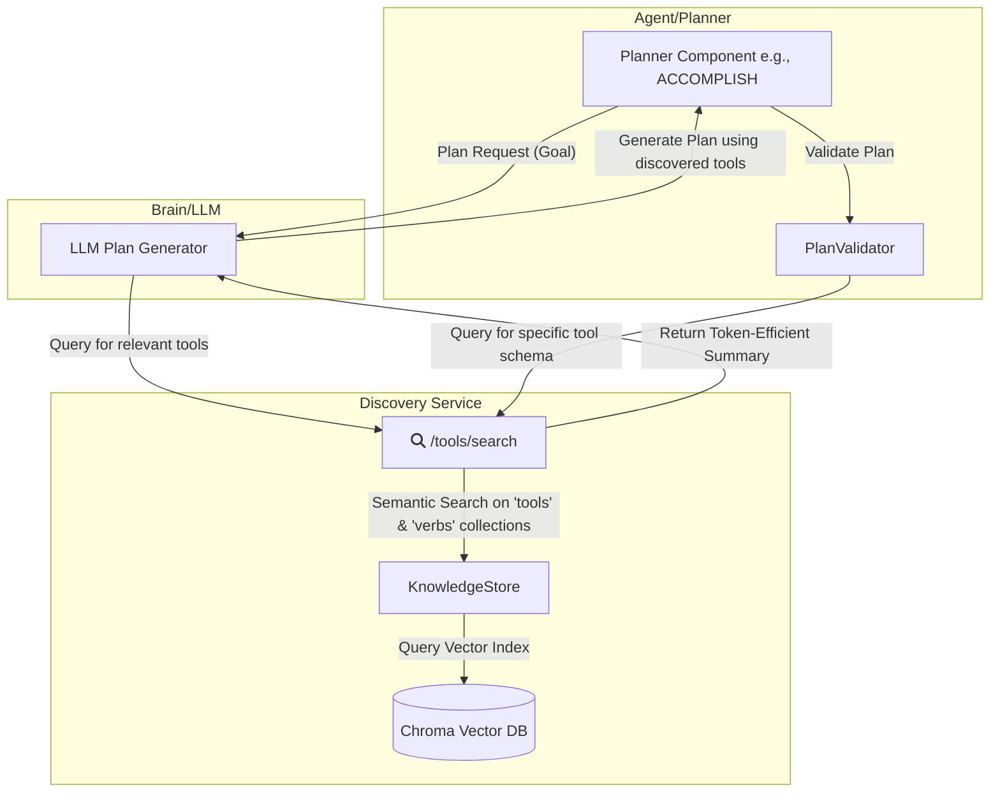

# Consolidated Verb and Tool Discovery Architecture

**Status:** Active | **Last Updated:** 2025-12-18

## 1. The Vision: A Scalable, Self-Growing Tool Ecosystem

The fundamental challenge in a sophisticated agentic system is managing its capabilities. A static, hardcoded list of "verbs" or "tools" is brittle and unscalable. As the system grows, it becomes impossible to maintain and limits the system's ability to adapt to novel tasks.

The vision of this architecture is to solve this problem by creating a **dynamic discovery service**. Instead of the agent's brain needing to know every tool beforehand, it can describe its *intent*. The discovery service then finds the right tool for the job. This approach allows the system's capabilities to grow infinitely without requiring constant updates to the core agent logic.

### Conceptual Architecture

At its heart, the architecture provides a discovery layer that sits between the agent's planning components and the underlying tool database. Planners like `ACCOMPLISH` can generate logical plans, and when a novel verb is encountered, a `NovelVerbHandler` can query the discovery layer to find a matching capability.

This conceptual flow is illustrated below. The "planners" (top) are decoupled from the "database" (bottom) by the "discovery service" (middle).

```
┌─────────────────────────────────────────────────────────┐
│            Enhanced Verb Discovery Architecture         │
├─────────────────────────────────────────────────────────┤
│  ┌──────────────┐    ┌───────────────────────────────┐  │
│  │  ACCOMPLISH  │    │      NovelVerbHandler         │  │
│  │   Plugin     │    │ (Logical Component)           │  │
│  └──────┬───────┘    └───────────┬───────────────────┘  │
│         │                        │                      │
│         ▼                        ▼                      │
└─────────┼────────────────────────┼──────────────────────┘
          │                        │
          │                        │
┌─────────▼────────────────────────▼──────────────────────┐
│           Discovery Service Layer                       │
│  ┌─────────────────────┐    ┌───────────────────────┐   │
│  │  Librarian API      │    │  KnowledgeStore       │   │
│  │  /verbs/discover    │    │  (Abstraction)        │   │
│  │  /tools/search      │    │                       │   │
│  └───────────┬─────────┘    └──────────┬────────────┘   │
│              │                         │                │
│              │                         │                │
└──────────────┼─────────────────────────┼────────────────┘
               │                         │
               │                         │
┌──────────────▼─────────────────────────▼────────────────┐
│           Chroma Vector Database Layer                  │
│  ┌─────────────────────┐    ┌────────────────────────┐  │
│  │   "verbs"           │    │   "tools"              │  │
│  │   Collection        │    │   Collection           │  │
│  │  - Verb manifests   │    │  - Tool manifests      │  │
│  │  - Semantic vectors │    │  - Semantic vectors    │  │
│  └─────────────────────┘    └────────────────────────┘  │
└─────────────────────────────────────────────────────────┘
```

---

## 2. The Implementation: A Phased Approach

To realize this vision, the architecture is designed to evolve through four distinct phases. This allows for incremental development and ensures the system remains stable while new, powerful features are added.

```mermaid
graph TD
    A[Phase 1: Core Semantic Discovery <br/>(Implemented)] --> B[Phase 2: Brain-Aware Planning <br/>(Implemented)]
    B --> C[Phase 3: Context-Aware Knowledge Graph <br/>(Future)]
    C --> D[Phase 4: AI-Driven Tool Engineering <br/>(Future)]
```

---

## 3. Phase 1 & 2: The Current, Operational System

The current system has successfully implemented the goals of the first two architectural phases: establishing a core semantic discovery service and integrating it directly into the Brain's planning loop. This forms the foundation of the entire Stage 7 actionVerb discovery mechanism.

### Concrete Architectural Diagram (Current State)

This diagram shows the actual services and communication flow in the implemented system.



### Key Implemented Components

*   **Librarian Service**: The central microservice exposing a REST API for knowledge management and discovery.
*   **KnowledgeStore (`knowledgeStore.ts`)**: An abstraction within the Librarian that manages interaction with ChromaDB, including embedding generation and querying.
*   **Chroma Vector Database**: The persistence layer, storing vector embeddings of tool/verb manifests for semantic search.

### Implemented Workflows

1.  **Brain-Aware Planning (Proactive Discovery)**: The Brain queries the Librarian's `/verbs/discover-for-planning` endpoint *before* generating a plan, receiving a token-efficient list of relevant tools to inform its output. This is the primary, operational workflow that makes the system "smart".
2.  **Plan Validation (Reactive Discovery)**: The `PlanValidator` uses the `/tools/search` endpoint to fetch the full schema for a given `actionVerb`, ensuring every step in a plan corresponds to a known, valid tool.

---

## 4. Phase 3: Context-Aware Knowledge Graph (Future)

This phase aims to evolve the current metadata-linking system into a more powerful, context-aware knowledge graph. The goal is to enable more sophisticated reasoning about tool chains and to disambiguate between similar tools based on the specific context of a task. This will be built upon the ChromaDB foundation by enriching the metadata.

### Proposed Architecture Enhancement

*   **Enriched Metadata Schema**: Tool manifests in Chroma will be expanded to include explicit relational and typing information. This allows the system to understand not just *what* a tool does, but what it *consumes* and *produces*.
    ```json
    {
      "verb": "GENERATE_REPORT",
      "id": "quarterly-sales-reporter-v2",
      "consumes": {
        "sales_data": "application/json; schema=quarterly_sales_v1",
        "trend_analysis": "text/markdown"
      },
      "produces": { "report_file": "application/pdf" },
      "relatedVerbs": ["ANALYZE_SALES", "SUMMARIZE_DATA"],
      "entities": ["sales", "finance", "quarterly_report"]
    }
    ```
*   **Graph Traversal via API**: The Librarian's `/graph/query` endpoint will be enhanced to support structured queries that can "traverse" this emergent graph, enabling questions like, "Find a sequence of tools to get from raw user data to a PDF report."
*   **Disambiguation Engine**: A logic layer in the Librarian that uses this rich graph context. When a search for "summarize" returns five tools, it can select the correct one by matching the `consumes` field to the output of the previous step in the plan.

---

## 5. Phase 4: AI-Driven Tool Engineering (Future)

This phase represents the ultimate vision: a system that can expand its own capabilities. It leverages the `Engineer` service to create a pipeline for autonomously creating, testing, and deploying new tools.

### Engineer Agent Enhancement

1.  **Autonomous Tool Wrapping**: An `Engineer` agent can take a high-level goal like "Integrate the public Stripe v1 API," find its OpenAPI spec, and automatically generate a compliant MCP plugin wrapper.
2.  **Verification and Testing**: The `Engineer` will then write and execute unit and integration tests to verify the new tool functions correctly.
3.  **Automated Registration Pipeline**: Upon successful testing, the `Engineer` will automatically create a full manifest (including `consumes`/`produces` metadata) and register the new tool with the Librarian, making it instantly discoverable by the entire system.

---

## 6. Implementation Roadmap

### Completed (Phase 1, 2, 3 & 4)

    *   [✅] **Core Infrastructure**: Librarian service with ChromaDB integration is operational.
    *   [✅] **Semantic Search**: Basic semantic search on `tools` and `verbs` collections is implemented.
    *   [✅] **Brain-Aware Planning**: `/verbs/discover-for-planning` endpoint is live and provides token-efficient results to the Brain.
    *   [✅] **Reactive Validation**: `/tools/search` endpoint serves schemas to the PlanValidator.
    *   [✅] **Initial Graph Capability**: `/graph/query` endpoint exists for basic entity-based searches.
    *   [✅] **Full Planner Integration**: `ACCOMPLISH` and `REFLECT` plugins now *exclusively* use `/verbs/discover-for-planning`, removing all static plugin guidance.
    *   [✅] **Robust Caching**: A robust in-memory cache in the `PlanValidator` client reduces redundant calls for plugin definitions.
    *   [✅] **Evolved Schema**: Tool manifest schema now supports `consumes`, `produces`, and `relatedVerbs` and this is supported by the `/tools/index` endpoint.
    *   [✅] **Disambiguation Engine**: The Librarian's `/tools/search` endpoint now uses `consumes` metadata to disambiguate between tools.
    *   [✅] **Enhanced Graph Query**: The `/graph/query` endpoint now supports structured, multi-step queries to find toolchains.
    *   [✅] Develop the `Engineer` agent's capability to parse an OpenAPI spec and generate a basic plugin structure.
    *   [✅] Create a sandboxed environment for the `Engineer` to run automated tests.
    *   [✅] Implement the full registration and submission pipeline.

## 7. Key Benefits & Success Metrics

*   **Benefits**:
    1.  **Unlimited Scalability**: System capabilities are no longer limited by prompt size.
    2.  **Intelligent Discovery**: Semantic matching finds relevant tools even if the verb isn't an exact match.
    3.  **System Coherence**: The knowledge graph will enable reasoning about how tools connect.
    4.  **Automated Growth**: AI-driven tool engineering will allow the system to expand automatically.
*   **Success Metrics**:
    *   **Planning Efficiency**: >50% reduction in planning failures caused by the Brain hallucinating non-existent verbs.
    *   **Discovery Accuracy**: >95% of capability queries return relevant, actionable tools.
    *   **Graph Query Performance**: P95 latency for `/graph/query` remains under 250ms.
    *   **Tool Onboarding Velocity**: Time to integrate a new external API is reduced by >80% via AI-driven engineering.