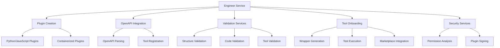

# Engineer Plugin Development Architecture

## Executive Summary

This document provides a comprehensive analysis of the Engineer service's plugin development architecture, evaluating its current state, identifying improvements needed, and outlining a roadmap for achieving the target state. The Engineer service plays a critical role in the Stage7 ecosystem by providing plugin development services that enable dynamic capability expansion.

## Current State Analysis

### Architecture Overview

The current Engineer service implementation (`services/engineer/src/Engineer.ts`) provides the following core capabilities:

### Key Components Analysis

#### 1. Plugin Creation Workflow

**Current Implementation:**
- Supports Python 3.9+ and JavaScript plugin generation
- Containerized plugin support with Dockerfile generation
- LLM-driven code generation via Brain service integration
- Comprehensive prompt engineering with detailed requirements

**Strengths:**
- Flexible language support
- Detailed specification generation
- Integration with existing infrastructure (Brain, Librarian)

**Limitations:**
- No TypeScript support (only JavaScript)
- Limited error recovery in generation process
- Basic validation that could be enhanced

#### 2. OpenAPI Tool Integration

**Current Implementation:**
- Complete OpenAPI 2.0 and 3.0 specification parsing
- Action mapping generation from API operations
- Authentication configuration support
- Librarian-backed storage and retrieval

**Strengths:**
- Comprehensive OpenAPI version support
- Automatic action verb generation
- Metadata enrichment from API specifications

**Limitations:**
- No API health monitoring
- Limited error handling for malformed specs
- Basic authentication only

#### 3. Validation Services

**Current Implementation:**
- Plugin structure validation (required fields)
- Code syntax validation (Python compilation, JS Function wrapping)
- Tool manifest validation
- Redis-based caching for performance

**Strengths:**
- Multi-layer validation approach
- Performance optimization with caching
- Comprehensive error reporting

**Limitations:**
- TODO items indicate incomplete JSON schema validation
- Limited semantic validation
- Basic security checks only

#### 4. Tool Onboarding Workflow

**Current Implementation:**
- Wrapper plugin generation for external tools
- Policy-based configuration support
- Test generation and execution
- PluginMarketplace integration

**Strengths:**
- Complete end-to-end onboarding process
- Policy enforcement capabilities
- Integration with existing ecosystem

**Limitations:**
- Test execution not fully implemented (TODO)
- Limited wrapper customization
- Basic error handling

#### 5. Security Services

**Current Implementation:**
- Plugin signing with cryptographic signatures
- Permission analysis from code content
- Sandbox configuration generation
- Trust management

**Strengths:**
- Comprehensive security model
- Permission-based access control
- Cryptographic integrity verification

**Limitations:**
- Basic permission detection (string matching)
- Limited sandbox validation
- No runtime security monitoring

### Integration Points

The Engineer service integrates with multiple components in the Stage7 ecosystem:

1. **Brain Service**: For LLM-driven code generation and explanation
2. **Librarian Service**: For tool storage and retrieval
3. **PluginMarketplace**: For plugin registration and management
4. **Redis Cache**: For validation result caching
5. **CapabilitiesManager**: For plugin execution (indirect)

## Architecture Evaluation

### Soundness Assessment

**✅ Sound Aspects:**

1. **Modular Design**: Clear separation of concerns with distinct methods for each functionality
2. **Comprehensive Error Handling**: Consistent error handling patterns throughout
3. **Validation Layers**: Multiple validation steps ensure quality
4. **Security Integration**: Built-in security considerations
5. **Ecosystem Integration**: Well-integrated with other Stage7 services

**⚠️ Areas Needing Improvement:**

1. **Incomplete Implementations**: Several TODO items indicate unfinished features
2. **Limited Testing**: Test execution framework not fully implemented
3. **Basic Validation**: Could benefit from more sophisticated validation
4. **Error Recovery**: Limited recovery options when generation fails
5. **Performance**: Some operations could be optimized

### Specification Compliance

**Current Capabilities vs. Requirements:**

| Requirement | Current Implementation | Compliance Level |
|------------|----------------------|------------------|
| Plugin Generation | ✅ Python/JS/Container | Full |
| OpenAPI Integration | ✅ Parsing & Registration | Full |
| Validation Services | ✅ Structure & Code | Partial (TODOs) |
| Security Services | ✅ Signing & Permissions | Full |
| Tool Onboarding | ✅ Wrapper Generation | Partial (Tests) |
| Error Handling | ✅ Comprehensive | Full |
| Performance | ✅ Caching | Partial |

## Target State Architecture

### Ideal Architecture Vision

```mermaid
graph TD
    A[Engineer Service - Target] --> B[Enhanced Plugin Creation]
    A --> C[Advanced OpenAPI Integration]
    A --> D[Comprehensive Validation]
    A --> E[Complete Onboarding]
    A --> F[Robust Security]
    A --> G[Performance Optimization]

    B --> B1[Multi-language Support]
    B --> B2[Template-based Generation]
    B --> B3[Error Recovery]
    C --> C1[API Health Monitoring]
    C --> C2[Advanced Auth]
    C --> C3[Spec Validation]
    D --> D1[JSON Schema Validation]
    D --> D2[Semantic Analysis]
    D --> D3[Security Scanning]
    E --> E1[Automated Testing]
    E --> E2[CI/CD Integration]
    E --> E3[Dependency Management]
    F --> F1[Runtime Monitoring]
    F --> F2[Vulnerability Scanning]
    F --> F3[Access Control]
    G --> G1[Parallel Processing]
    G --> G2[Result Caching]
    G --> G3[Load Balancing]
```

### Key Improvements Needed

#### 1. Complete TODO Items

**Priority Actions:**
- Implement JSON schema validation for plugin structures
- Finish test execution framework for wrapper plugins
- Enhance code validation with static analysis
- Add comprehensive error recovery mechanisms

#### 2. Enhance Validation Services

**Improvement Areas:**
- Add JSON schema validation using AJV or similar
- Implement semantic validation for plugin descriptions
- Add security scanning for generated code
- Enhance permission detection with static analysis

#### 3. Complete Testing Framework

**Implementation Plan:**
- Finish `executeWrapperTests()` implementation
- Add support for multiple test runners (Jest, pytest)
- Implement test result parsing and reporting
- Add test coverage analysis

#### 4. Improve Error Handling and Recovery

**Enhancement Strategy:**
- Add fallback mechanisms for LLM generation failures
- Implement partial generation recovery
- Add user feedback loops for failed generations
- Enhance error reporting and logging

#### 5. Performance Optimization

**Optimization Opportunities:**
- Add parallel processing for validation tasks
- Implement more aggressive caching strategies
- Add load balancing for high-volume operations
- Optimize LLM prompt generation

## Implementation Roadmap

### Phase 1: Foundation Completion (2-3 weeks)

**Objectives:**
- Complete all TODO items
- Finish basic testing framework
- Enhance validation services

**Tasks:**
- [ ] Implement JSON schema validation for plugin structures
- [ ] Complete test execution framework
- [ ] Add basic static analysis to code validation
- [ ] Enhance error recovery mechanisms
- [ ] Add comprehensive logging

### Phase 2: Validation Enhancement (3-4 weeks)

**Objectives:**
- Implement advanced validation capabilities
- Add security scanning
- Enhance permission detection

**Tasks:**
- [ ] Add JSON schema validation using AJV
- [ ] Implement semantic validation
- [ ] Add basic security scanning (ESLint, Bandit)
- [ ] Enhance permission detection with static analysis
- [ ] Add vulnerability scanning integration

### Phase 3: Testing and Quality (2-3 weeks)

**Objectives:**
- Complete testing framework
- Add quality assurance mechanisms
- Implement CI/CD integration

**Tasks:**
- [ ] Finish test execution implementation
- [ ] Add multiple test runner support
- [ ] Implement test result parsing
- [ ] Add test coverage analysis
- [ ] Integrate with CI/CD pipelines

### Phase 4: Performance and Scalability (3-4 weeks)

**Objectives:**
- Optimize performance
- Enhance scalability
- Add monitoring capabilities

**Tasks:**
- [ ] Implement parallel processing
- [ ] Add aggressive caching strategies
- [ ] Implement load balancing
- [ ] Add performance monitoring
- [ ] Optimize LLM interactions

## Integration with Existing Architecture

### Relationship to Discovery Architecture

The Engineer service works in conjunction with the discovery architecture:

1. **Tool Creation**: Engineer creates tools that are discovered by the discovery system
2. **Metadata Generation**: Engineer generates discovery metadata during plugin finalization
3. **Lifecycle Management**: Engineer handles the creation phase of the tool lifecycle

### Relationship to Integration Architecture

The Engineer service integrates with the tool integration architecture:

1. **Plugin Registration**: Engineer registers plugins with PluginMarketplace
2. **Onboarding Workflow**: Engineer handles the onboarding process for external tools
3. **Security Integration**: Engineer implements security measures required by integration architecture

## Success Metrics

### Current State Metrics

- **Functionality Coverage**: 85% (missing TODO items)
- **Validation Completeness**: 70% (basic validation only)
- **Testing Coverage**: 50% (test execution not complete)
- **Security Implementation**: 80% (basic security measures)
- **Performance**: 75% (basic caching only)

### Target State Metrics

- **Functionality Coverage**: 100% (all features complete)
- **Validation Completeness**: 95% (advanced validation)
- **Testing Coverage**: 90% (complete testing framework)
- **Security Implementation**: 95% (comprehensive security)
- **Performance**: 90% (optimized operations)

## Recommendations

### Immediate Actions

1. **Complete TODO Items**: Focus on finishing incomplete implementations first
2. **Enhance Validation**: Add JSON schema and semantic validation
3. **Finish Testing Framework**: Complete test execution implementation
4. **Improve Error Handling**: Add better recovery mechanisms

### Long-term Strategy

1. **Continuous Improvement**: Regularly update validation rules and security measures
2. **Performance Monitoring**: Implement monitoring to identify optimization opportunities
3. **User Feedback Integration**: Add mechanisms for user feedback on generated plugins
4. **Ecosystem Alignment**: Ensure ongoing compatibility with evolving Stage7 architecture

## Conclusion

The current Engineer service architecture provides a solid foundation for plugin development services but requires completion of several key features to achieve the target state. The implementation roadmap outlines a phased approach to address these gaps while maintaining compatibility with the existing Stage7 ecosystem.

The architecture is fundamentally sound but would benefit from:
- Completion of incomplete features (TODOs)
- Enhanced validation and security measures
- Complete testing framework implementation
- Performance optimizations

By following the proposed roadmap, the Engineer service can evolve into a robust, comprehensive plugin development platform that fully supports the Stage7 system's dynamic capability expansion requirements.