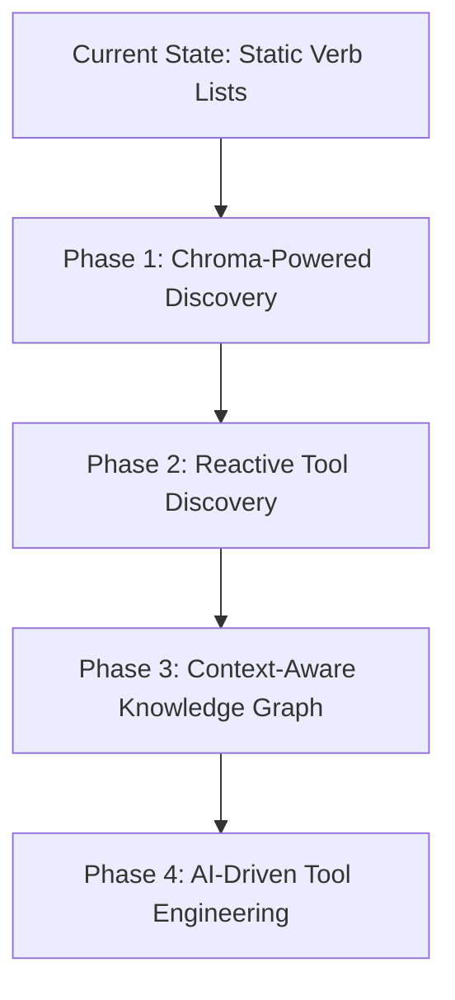

# Enhanced Verb Discovery & Tool Integration Architecture

## Executive Summary

This document presents a comprehensive architecture for dynamic verb discovery and tool integration, combining the best elements from previous proposals into a unified, phased approach. The solution leverages existing Chroma-powered knowledge graph infrastructure while incorporating reactive discovery mechanisms and future-proof evolutionary concepts.

## Problem Analysis

### Current Limitations

1. **Static Verb Manifests**: ACCOMPLISH plugin includes verb manifests directly in prompts via `_create_detailed_plugin_guidance()`
2. **Token Limit Constraints**: As MCP Tools and plugins grow, static lists hit LLM context window limits
3. **Discovery Problem**: LLMs cannot discover verbs that exist but aren't included in static lists
4. **Redundant Verb Creation**: System creates novel verbs when existing ones could accomplish the task
5. **Tool Integration Complexity**: Multiple tool types (Python, OpenAPI, MCP) require unified management

### Current Infrastructure Analysis

The system already has sophisticated capabilities:

- **ChromaDB Integration**: Fully operational instance with semantic search
- **KnowledgeStore**: `services/librarian/src/knowledgeStore/index.ts` handles vector database interactions
- **Embedding Function**: Uses `Xenova/all-MiniLM-L6-v2` sentence-transformer model
- **REST API**: Librarian exposes `/knowledge/query` and `/knowledge/save` endpoints
- **PluginMarketplace**: Unified management system for all tool types
- **CapabilitiesManager**: Central execution dispatcher for all action verbs

## Unified Architecture Proposal

### Core Strategy: Phased Evolution with Discovery-First Approach



### Phase 1: Chroma-Powered Semantic Discovery (Current Focus)

#### Architecture Overview

```
┌───────────────────────────────────────────────────────┐
│            Enhanced Verb Discovery Architecture        │
├───────────────────────────────────────────────────────┤
│  ┌─────────────┐    ┌───────────────────────────────┐  │
│  │  ACCOMPLISH  │    │      NovelVerbHandler         │  │
│  │   Plugin     │    │                               │  │
│  └──────┬───────┘    └───────────┬───────────────────┘  │
│         │                        │                     │
│         ▼                        ▼                     │
└─────────┼────────────────────────┼─────────────────────┘
          │                        │
          │                        │
┌─────────▼────────────────────────▼─────────────────────┐
│           Discovery Service Layer                  │
│  ┌─────────────────────┐    ┌───────────────────────┐  │
│  │  Librarian API      │    │  KnowledgeStore        │  │
│  │  /verbs/discover     │    │  (Extended)            │  │
│  │  /verbs/register     │    │                        │  │
│  │  /tools/search       │    │                        │  │
│  └──────────┬─────────┘    └──────────┬─────────────┘  │
│             │                        │               │
│             │                        │               │
└─────────────┼────────────────────────┼───────────────────┘
              │                        │
              │                        │
┌─────────────▼────────────────────────▼───────────────────┐
│           Chroma Vector Database Layer               │
│  ┌─────────────────────┐    ┌───────────────────────┐  │
│  │   "verbs"           │    │   "tools"              │  │
│  │   Collection        │    │   Collection           │  │
│  │  - Verb manifests   │    │  - Tool manifests      │  │
│  │  - Semantic vectors │    │  - Semantic vectors    │  │
│  └─────────────────────┘    └───────────────────────┘  │
└───────────────────────────────────────────────────────┘
```

#### Chroma Collection Structure

**Collection: "verbs"**
- **Documents**: Verb manifests in JSON format
- **Metadata Schema**:
  ```json
  {
    "verb": "SEARCH",
    "description": "Search the web for information",
    "capabilities": ["web_search", "information_retrieval"],
    "category": "data_retrieval",
    "examples": ["Find competitor websites", "Research market trends"],
    "inputDefinitions": [...],
    "outputDefinitions": [...]
  }
  ```
- **Embeddings**: Semantic vectors generated from combined text fields

**Collection: "tools"**
- **Documents**: Tool manifests (MCP, OpenAPI, Python plugins)
- **Metadata Schema**:
  ```json
  {
    "toolId": "weather-api-v1",
    "name": "Weather API Tool",
    "type": "openapi",
    "actionVerbs": ["GET_WEATHER", "FORECAST"],
    "capabilities": ["weather_data", "meteorological_information"],
    "description": "Provides current weather and forecast data"
  }
  ```

### Phase 2: Reactive Tool Discovery (Enhanced NovelVerbHandler)

#### Discovery Workflow

1. **Intent-Based Planning**: ACCOMPLISH planner generates plans using logical, descriptive action verbs
2. **Reactive Discovery**: When encountering unknown verbs, NovelVerbHandler:
   - First performs semantic search on both verbs and tools collections
   - Attempts to find existing capabilities that match the intent
   - Substitutes discovered verbs/tools when high-confidence matches found
   - Falls back to decomposition or tool creation when no matches exist

#### Enhanced NovelVerbHandler Logic

```typescript
async function handleUnknownVerb(verbInfo: VerbInfo, context: ExecutionContext) {
    // 1. Semantic search for existing verbs
    const verbMatches = await knowledgeStore.discoverVerbs(verbInfo.description);

    // 2. Semantic search for tools that can fulfill the capability
    const toolMatches = await knowledgeStore.searchTools(verbInfo.description);

    // 3. Evaluate matches and select best option
    const bestMatch = selectBestMatch(verbMatches, toolMatches);

    if (bestMatch) {
        // Substitute and execute
        return executeWithSubstitution(bestMatch, context);
    } else {
        // Fall back to decomposition or tool creation
        return originalNovelVerbHandling(verbInfo, context);
    }
}
```

### Phase 3: Context-Aware Knowledge Graph (Future)

#### Architecture Enhancement

- **Graph Database Integration**: Neo4j managed by Librarian
- **Contextual Entity Linking**: Tools connected to domain entities (Airline, Restaurant, etc.)
- **Disambiguation Engine**: Graph traversal for precise tool selection based on context

### Phase 4: AI-Driven Tool Engineering (Future)

#### Engineer Agent Enhancement

1. **Autonomous Tool Wrapping**: Generate plugin wrappers for external APIs
2. **Verification Testing**: Auto-generate and run basic functionality tests
3. **Registration Pipeline**: Seamless integration into PluginMarketplace

## Implementation Roadmap

### Phase 1: Core Discovery Infrastructure (2-3 weeks)

- [x] Extend KnowledgeStore with verb-specific methods
- [x] Add Librarian API endpoints for verb discovery
- [x] Create verb registration pipeline
- [x] Set up Chroma collections for verbs and tools
- [ ] Enhance NovelVerbHandler with discovery logic
- [ ] Add fallback mechanisms for discovery failures
- [ ] Implement caching for performance optimization

### Phase 2: Integration & Testing (3-4 weeks)

- [ ] Modify ACCOMPLISH plugin to use discovery API
- [ ] Update NovelVerbHandler with full discovery workflow
- [ ] Integrate with PluginMarketplace for tool discovery
- [ ] Performance testing of discovery queries
- [ ] Failure mode testing and fallback verification
- [ ] Integration testing with existing workflows

### Phase 3: Advanced Features (Future Phases)

- [ ] Knowledge graph implementation for context-aware discovery
- [ ] Engineer agent enhancements for autonomous tool creation
- [ ] External tool governance and "Airlock" process
- [ ] Health monitoring and automatic deactivation

## Key Benefits

1. **Unlimited Scalability**: No more token limit constraints
2. **Intelligent Discovery**: Semantic matching finds relevant verbs and tools
3. **Resource Optimization**: Reduces redundant verb creation
4. **Architectural Consistency**: Leverages existing knowledge graph
5. **Proven Technology**: Uses working Chroma + sentence-transformers stack
6. **Future-Proof**: Phased approach allows gradual enhancement
7. **Unified Management**: Single discovery interface for all tool types

## Success Metrics

- **Discovery Accuracy**: 90%+ of capability queries return relevant verbs/tools
- **Performance**: <100ms average discovery query time
- **Adoption Rate**: 80%+ reduction in novel verb creation
- **System Stability**: Zero downtime during transition
- **Coverage**: 95%+ of existing tools discoverable via semantic search

## Risk Mitigation

1. **Fallback Mechanisms**: Graceful degradation if discovery fails
2. **Performance Monitoring**: Real-time query latency tracking
3. **Gradual Rollout**: Phased implementation with feature flags
4. **Comprehensive Testing**: Extensive unit and integration tests
5. **Documentation**: Complete API and usage documentation

## Relationship to Other Architectures

This document represents the **Discovery Architecture** component of the overall system. It works in conjunction with:

- **Tool Integration Architecture** (`mcp-tool-integration.md`): Handles tool registration, management, and execution
- **PluginMarketplace**: Provides unified tool management interface
- **CapabilitiesManager**: Executes discovered verbs and tools

The discovery architecture focuses on **how tools are found**, while the integration architecture focuses on **how tools are managed and executed**.