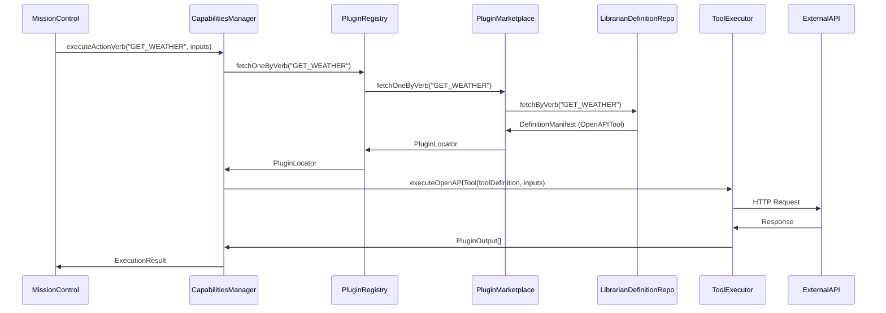
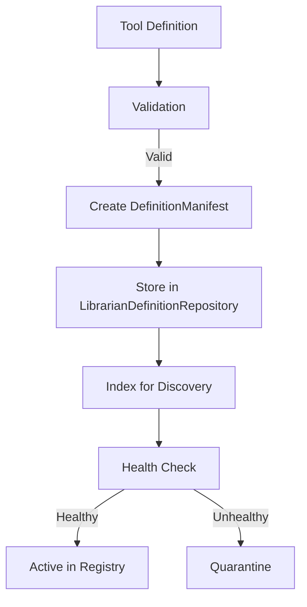

# Enhanced MCP and OpenAPI Tool Integration & Management Architecture

## Overview

This document outlines the comprehensive architecture for integrating and managing MCP (Mission Control Platform) Tools and OpenAPI Tools within the agent system. It represents the **Integration Architecture** component that works in conjunction with the **Discovery Architecture** (`verb-discovery-architecture-proposal.md`).

## Core Principles

1. **Unified Management**: All tool types managed through PluginMarketplace
2. **Discovery Integration**: Seamless integration with semantic discovery mechanisms
3. **Lifecycle Governance**: Comprehensive tool lifecycle management
4. **Security First**: Robust security and access control mechanisms

## Architecture Components

### 1. Tool Definition Structures

#### MCPTool Definition
```typescript
interface MCPTool {
    id: string;
    name: string;
    description: string;
    actionMappings: {
        actionVerb: string;
        mcpServiceTarget: string;
        inputSchema?: any;
        outputSchema?: any;
    }[];
    authentication: {
        type: 'api_key' | 'oauth2' | 'basic';
        configuration: any;
    };
    metadata?: {
        categories: string[];
        capabilities: string[];
        documentationUrl?: string;
    };
}
```

#### OpenAPITool Definition
```typescript
interface OpenAPITool {
    id: string;
    name: string;
    description: string;
    specUrl: string;
    specContent?: any; // Inline OpenAPI specification
    actionMappings: {
        actionVerb: string;
        operationId: string;
        parametersMapping?: any;
    }[];
    authentication: {
        type: 'api_key' | 'oauth2' | 'basic' | 'none';
        configuration: any;
    };
    metadata?: {
        categories: string[];
        capabilities: string[];
        documentationUrl?: string;
    };
}
```

#### DefinitionManifest (Unified Wrapper)
```typescript
class DefinitionManifest extends PluginManifest {
    definitionType: 'OPENAPI' | 'MCP';
    toolDefinition: MCPTool | OpenAPITool;
    discoveryMetadata: {
        semanticDescription: string;
        capabilityKeywords: string[];
        usageExamples: string[];
    };

    // Helper methods
    static createOpenApiDefinitionManifest(tool: OpenAPITool, primaryVerb: string): DefinitionManifest;
    static createMcpDefinitionManifest(tool: MCPTool, primaryVerb: string): DefinitionManifest;
}
```

### 2. Enhanced PluginMarketplace Architecture

```
┌───────────────────────────────────────────────────────┐
│              Enhanced PluginMarketplace               │
├───────────────────────────────────────────────────────┤
│  ┌─────────────────────┐    ┌───────────────────────┐  │
│  │  GitHubRepository   │    │  LocalRepository      │  │
│  └──────────┬─────────┘    └──────────┬─────────────┘  │
│             │                        │               │
│  ┌──────────▼─────────┐    ┌──────────▼─────────────┐  │
│  │  MongoRepository   │    │  LibrarianDefinition   │  │
│  │  (Code Plugins)    │    │  Repository            │  │
│  │                    │    │  (MCP/OpenAPI Tools)   │  │
│  └──────────┬─────────┘    └──────────┬─────────────┘  │
│             │                        │               │
│             └────────────┬────────────┘               │
│                          │                            │
│                          ▼                            │
│               ┌─────────────────────┐                 │
│               │  Unified Registry  │                 │
│               │  Interface         │                 │
│               └──────────┬─────────┘                 │
│                          │                            │
└──────────────────────────┼────────────────────────────┘
                           │
                           ▼
┌───────────────────────────────────────────────────────┐
│            CapabilitiesManager Integration           │
└───────────────────────────────────────────────────────┘
```

### 3. LibrarianDefinitionRepository Enhancement

#### Key Methods
```typescript
class LibrarianDefinitionRepository implements PluginRepository {
    // Core CRUD operations
    async store(definitionManifest: DefinitionManifest): Promise<void>;
    async list(): Promise<PluginLocator[]>;
    async fetch(id: string, version?: string): Promise<DefinitionManifest>;
    async fetchByVerb(verb: string, version?: string): Promise<DefinitionManifest>;
    async delete(id: string, version?: string): Promise<void>;

    // Discovery integration methods
    async indexForDiscovery(manifest: DefinitionManifest): Promise<void>;
    async updateDiscoveryMetadata(id: string, metadata: DiscoveryMetadata): Promise<void>;
    async getToolsByCapability(capability: string): Promise<DefinitionManifest[]>;

    // Health monitoring
    async markToolHealthy(id: string, healthData: ToolHealthData): Promise<void>;
    async markToolUnhealthy(id: string, reason: string): Promise<void>;
    async getToolHealthStatus(id: string): Promise<ToolHealthStatus>;
}
```

### 4. CapabilitiesManager Integration Layer

#### Enhanced Execution Flow


## Tool Lifecycle Management

### 1. Registration & Onboarding



### 2. Discovery Integration

The enhanced architecture integrates with the discovery system:

1. **Automatic Indexing**: All tools automatically indexed in Chroma for semantic search
2. **Metadata Enrichment**: Tools include discovery metadata (semantic descriptions, capability keywords)
3. **Health-Aware Discovery**: Discovery results filter out unhealthy tools

### 3. Execution & Monitoring

```typescript
async function executeActionVerb(verb: string, inputs: any, traceId: string) {
    // 1. Get handler (integrates with discovery)
    const manifest = await this.getHandlerForActionVerb(verb);

    // 2. Health check
    if (manifest.language === 'openapi' || manifest.language === 'mcp') {
        const healthStatus = await checkToolHealth(manifest.id);
        if (healthStatus !== 'healthy') {
            throw new Error(`Tool ${manifest.id} is currently unavailable`);
        }
    }

    // 3. Execute based on type
    switch (manifest.language) {
        case 'openapi':
            return this.executeOpenAPITool(manifest.toolDefinition, inputs, traceId);
        case 'mcp':
            return this.executeMCPTool(manifest.toolDefinition, inputs, traceId);
        case 'python':
        case 'javascript':
            return this.executePlugin(manifest, inputs, traceId);
        default:
            return this.handleUnknownVerb(verb, inputs, traceId);
    }
}
```

## Security & Governance

### 1. Access Control

```typescript
interface ToolAccessPolicy {
    toolId: string;
    allowedAgents: string[]; // Agent IDs or roles
    allowedUsers: string[];  // User IDs or roles
    rateLimits?: {
        requestsPerMinute: number;
        requestsPerHour: number;
        requestsPerDay: number;
    };
    budgetLimits?: {
        maxCostPerMonth: number;
        currentMonthCost: number;
    };
}
```

### 2. Sandboxed Execution

All external tool execution goes through sandboxed wrappers:

```typescript
class ToolExecutionSandbox {
    constructor(private toolDefinition: MCPTool | OpenAPITool) {}

    async execute(inputs: any): Promise<any> {
        // 1. Input validation
        this.validateInputs(inputs);

        // 2. Rate limiting
        await this.checkRateLimits();

        // 3. Budget checking (for paid APIs)
        await this.checkBudget();

        // 4. Sandboxed execution
        try {
            const result = await this.safeExecute(inputs);
            return this.validateOutputs(result);
        } catch (error) {
            this.handleExecutionError(error);
            throw error;
        }
    }

    private async safeExecute(inputs: any): Promise<any> {
        // Implementation depends on tool type
        // - For OpenAPI: HTTP client with strict timeout
        // - For MCP: Service call with circuit breaker
        // - All execution isolated and monitored
    }
}
```

## Integration with Discovery Architecture

### 1. Discovery Metadata Schema

```typescript
interface DiscoveryMetadata {
    // Basic information
    semanticDescription: string;
    capabilityKeywords: string[];
    usageExamples: string[];

    // Contextual information
    domainEntities?: string[]; // e.g., ["Airline", "Restaurant", "Weather"]
    relatedVerbs?: string[];   // e.g., ["BOOK", "RESERVE"] for a booking tool

    // Quality metrics
    discoveryConfidenceScore?: number; // 0-1 scale
    usageFrequency?: number;          // How often this tool is used
    lastUsed?: Date;                  // When was it last successfully used
}
```

### 2. Discovery Integration Points

1. **Automatic Indexing**: Tools automatically added to Chroma collections on registration
2. **Metadata Synchronization**: Discovery metadata kept in sync with tool definitions
3. **Health Status Integration**: Discovery results filter out unhealthy tools
4. **Access Control Integration**: Discovery respects access policies

### 3. Engineer Service Integration

The Engineer service (`services/engineer/src/Engineer.ts`) plays a crucial role in tool creation and integration:

1. **Tool Generation**: Creates new plugins and tools based on requirements
2. **Onboarding Workflow**: Handles the complete tool onboarding process
3. **Validation Services**: Provides comprehensive validation for generated tools
4. **Security Integration**: Implements plugin signing and permission analysis

For detailed information on the Engineer service architecture, see [`engineer-plugin-architecture.md`](docs/engineer-plugin-architecture.md).

## Implementation Roadmap

### Phase 1: Core Integration Infrastructure (3-4 weeks)

- [ ] Enhance LibrarianDefinitionRepository with discovery methods
- [ ] Implement automatic Chroma indexing for tools
- [ ] Add discovery metadata to DefinitionManifest
- [ ] Integrate health monitoring with discovery
- [ ] Implement access control mechanisms
- [ ] Create sandboxed execution wrappers

### Phase 2: Discovery Integration (2-3 weeks)

- [ ] Connect PluginMarketplace to discovery system
- [ ] Implement metadata synchronization
- [ ] Add discovery filters (health, access control)
- [ ] Enhance CapabilitiesManager with discovery-aware execution
- [ ] Performance testing of integrated system

### Phase 3: Advanced Features (Future)

- [ ] Context-aware discovery integration
- [ ] Usage analytics and optimization
- [ ] Automated tool health recovery
- [ ] Advanced access control policies

## Relationship to Discovery Architecture

This document represents the **Integration Architecture** component that works in conjunction with:

- **Discovery Architecture** (`verb-discovery-architecture-proposal.md`): Handles how tools are discovered
- **PluginMarketplace**: Provides unified tool management interface
- **CapabilitiesManager**: Executes discovered and integrated tools

**Key Integration Points:**
1. **Discovery → Integration**: Tools discovered via semantic search are managed through this architecture
2. **Integration → Discovery**: All integrated tools are automatically available for discovery
3. **Unified Execution**: CapabilitiesManager handles both discovered and statically-known tools

## Migration Path from Previous Architecture

### Changes from Original mcp-tool-integration.md

1. **Enhanced Discovery Integration**: Added automatic indexing and metadata for discovery
2. **Health Monitoring**: Added comprehensive tool health tracking
3. **Security Enhancements**: Added access control and sandboxed execution
4. **Unified Architecture**: Clarified relationship with discovery architecture
5. **Future-Proofing**: Added phases for advanced features

### Backward Compatibility

The enhanced architecture maintains full backward compatibility:
- Existing MCPTool and OpenAPITool definitions work unchanged
- Current PluginMarketplace interfaces remain stable
- CapabilitiesManager execution logic preserved
- All enhancements are additive

## Success Metrics

- **Integration Coverage**: 100% of MCP/OpenAPI tools managed through unified system
- **Discovery Integration**: 100% of integrated tools discoverable via semantic search
- **Execution Reliability**: <1% failure rate for tool execution
- **Security Compliance**: 100% of external tools executed through sandbox
- **Performance**: <50ms overhead for discovery-integrated execution
